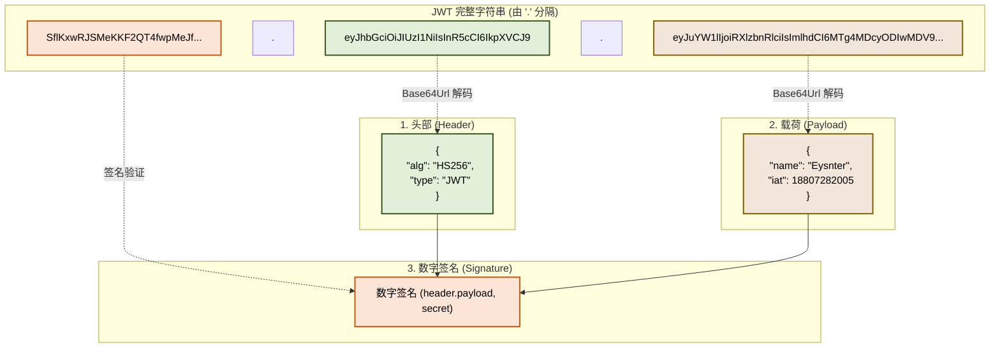
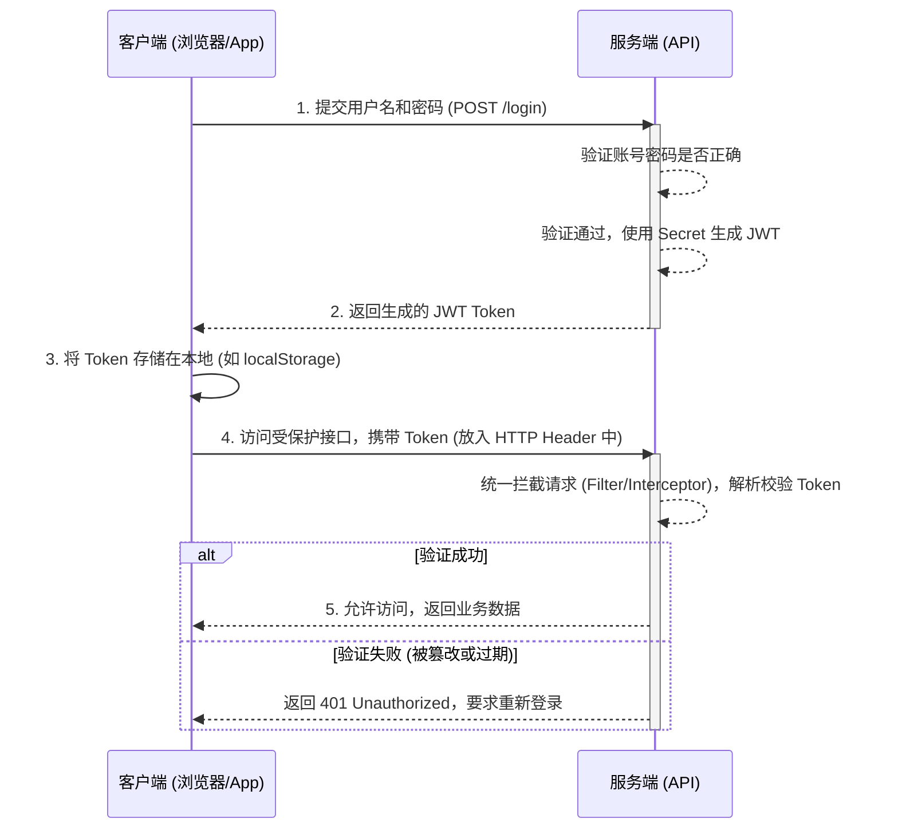
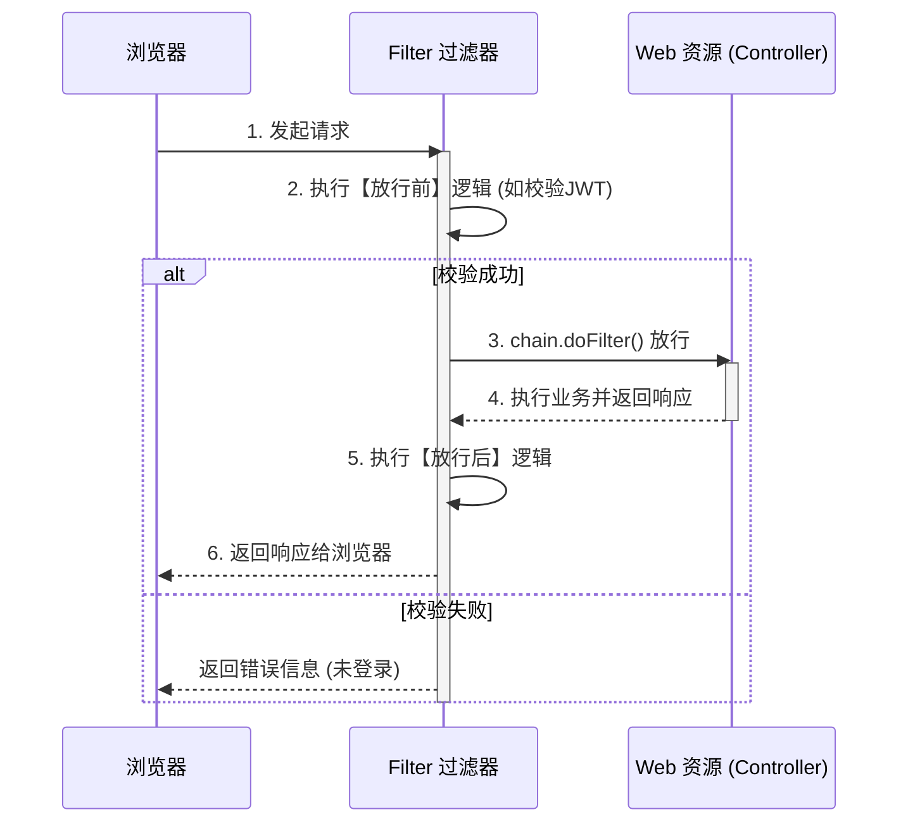
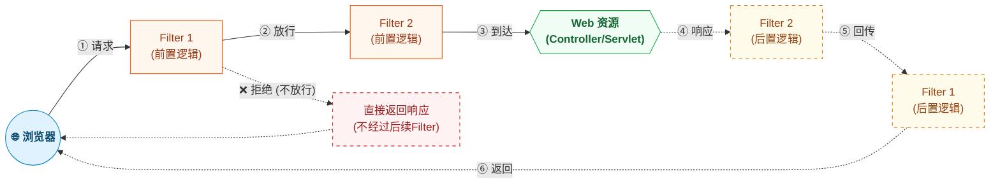
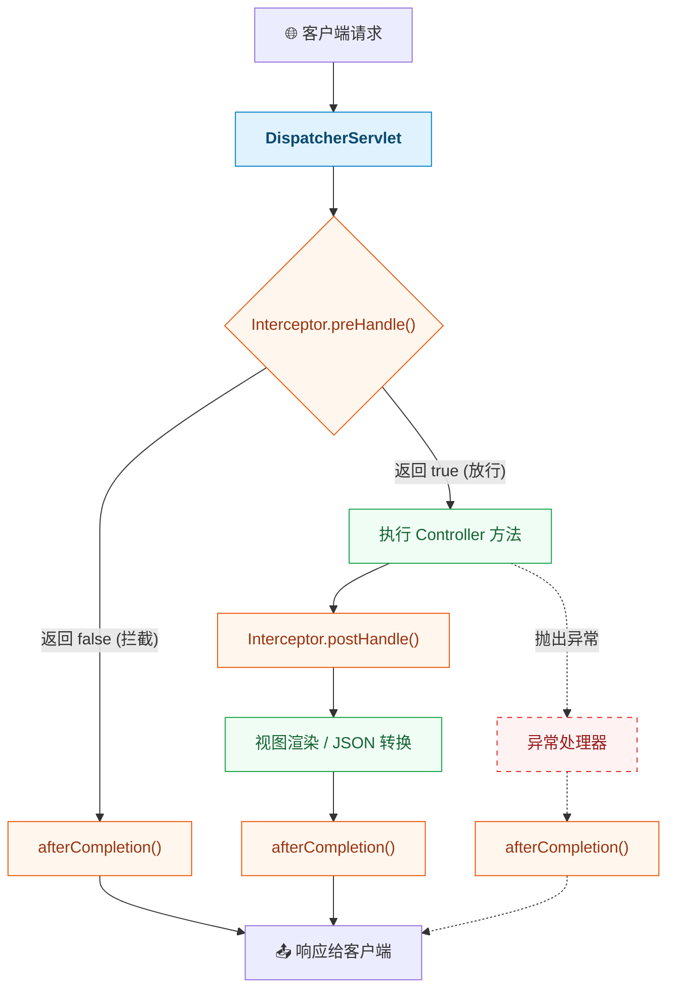

# 深入解析 JWT 令牌与 Java 整合实战

在现代 Web 应用程序和微服务架构中，实现安全、高效的用户认证是至关重要的一环。传统的 Session 机制在分布式环境下显得捉襟见肘，而 **JWT (JSON Web Token)** 的出现，为跨域、分布式的无状态认证提供了一种优雅的解决方案。

## 1. 什么是 JWT？

**官网链接:** [[https://www.jwt.io/]]

**JWT (JSON Web Token)** 是一个开放标准 (RFC 7519)，它定义了一种紧凑的、自包含的方式，用于在各方之间以 JSON 对象的形式安全地传输信息。由于此信息是经过数字签名的，因此可以被验证和信任。

- **紧凑 (Compact)**：由于其体积小，JWT 可以通过 URL、POST 参数或者 HTTP 请求头发送。紧凑的尺寸也意味着传输速度快。
- **自包含 (Self-contained)**：Payload 中包含了所有关于用户的必要信息，避免了多次查询数据库的需要。
- **无状态 (Stateless)**：服务端不需要保存 Session 状态，所有的认证信息都在 Token 中，天然支持分布式和微服务架构。

## 2. JWT 的结构

JWT 令牌实际上是一个很长的字符串，它由三个部分组成，各部分之间用点（`.`）分隔。其整体格式为：`Header.Payload.Signature`。



1. **Header (标头)**：包含令牌的类型（即 JWT）以及所使用的签名算法（如 HMAC SHA 256 或 RSA）。
2. **Payload (载荷)**：包含声明（Claims）。声明是关于实体（通常是用户）和其他数据的陈述。例如：用户的 ID、用户名、令牌过期时间等。
3. **Signature (签名)**：用于验证消息在传递过程中没有被更改。生成签名需要使用编码后的 Header、编码后的 Payload 以及一个秘钥（Secret），然后通过 Header 中指定的算法进行签名。

> **注意：** `Header` 和 `Payload` 仅仅是进行了 `Base64 Url` 编码，并未加密，因此任何人都可以解码并查看其内容。**绝对不要在 Payload 中存放密码等敏感信息。**

## 3. 核心优缺点

### 优点

- **无状态且可扩展**：服务端不存储 Session，易于水平扩展，非常适合微服务。
- **跨域支持良好**：基于 Token 的认证天然不依赖 Cookie，不存在 CORS（跨域资源共享）带来的 Cookie 发送问题。
- **性能高**：减少了服务端的数据库/缓存查询操作。
- **支持移动端**：原生 App 对 Cookie 的支持较弱，而 Token 方案更适合 API 调用。

### 缺点

- **令牌失效处理困难**：一旦 JWT 签发，在到期之前它都是有效的。如果用户注销或密码被修改，很难在服务端单方面让正在流通的 JWT 立即失效（除非借助黑名单机制，但这违背了无状态的初衷）。
- **数据冗余/体积增大**：如果 Payload 包含的信息过多，Token 会变得很长，每次请求都会增加网络开销。
- **数据安全性**：如果不结合 HTTPS 传输，Token 容易被拦截。Payload 未加密，信息是透明的。

## 4. 认证流程

JWT 典型的认证和请求交互流程如下：



## 5. Java 的引入与实战 (生成 JWT)

在 Java (Spring Boot) 环境下，我们通常使用 `jjwt` 库来生成和解析 JWT。

### 5.1 引入依赖

从 JJWT 0.12.x 版本开始，原先单一的 `jjwt` 依赖被拆分为三个模块：`jjwt-api`（核心 API）、`jjwt-impl`（运行时实现）、`jjwt-jackson`（JSON 序列化支持）。

```xml title="pom.xml"
<properties>
    <jjwt.version>0.12.6</jjwt.version>
</properties>

<!-- JWT (JJWT 0.12.x 拆分为三个模块) -->
<dependency>
    <groupId>io.jsonwebtoken</groupId>
    <artifactId>jjwt-api</artifactId>
    <version>${jjwt.version}</version>
</dependency>

<dependency>
    <groupId>io.jsonwebtoken</groupId>
    <artifactId>jjwt-impl</artifactId>
    <version>${jjwt.version}</version>
    <scope>runtime</scope>
</dependency>

<dependency>
    <groupId>io.jsonwebtoken</groupId>
    <artifactId>jjwt-jackson</artifactId>
    <version>${jjwt.version}</version>
    <scope>runtime</scope>
</dependency>
```

### 5.2 实体类定义

```java title="Emp.java"
@Data
public class Emp {
    private Integer id;
    private String username;
    private String password;
    private String name;
    // ...其他字段
}
```

```java title="LoginInfo.java"
// 封装登录结果，将 JWT 令牌随用户信息一起返回给前端
@Data
@NoArgsConstructor
@AllArgsConstructor
public class LoginInfo {
    private Integer id;
    private String username;
    private String name;
    private String token;
}
```

```java title="Result.java"
// 统一响应结果类
@Data
public class Result {
    private Integer code; // 编码：1成功，0为失败
    private String msg;
    private Object data;

    public static Result success() {
        Result result = new Result();
        result.code = 1;
        result.msg = "success";
        return result;
    }

    public static Result success(Object object) {
        Result result = new Result();
        result.data = object;
        result.code = 1;
        result.msg = "success";
        return result;
    }

    public static Result error(String msg) {
        Result result = new Result();
        result.msg = msg;
        result.code = 0;
        return result;
    }
}
```

### 5.3 封装工具类 (JwtUtils)

> **注意：** 旧版 JJWT 0.9.x 使用 `signWith(SignatureAlgorithm.HS256, key)`、`setClaims()`、`setSigningKey()` 等方法，这些在 0.12.x 中已被废弃。新版 API 使用 `Keys.hmacShaKeyFor()` 生成类型安全的 `SecretKey`，并采用 `signWith(key)`、`addClaims()`、`verifyWith()`、`parseSignedClaims()` 等链式方法。

```java title="JwtUtils.java"
import io.jsonwebtoken.Claims;
import io.jsonwebtoken.Jwts;
import io.jsonwebtoken.security.Keys;

import javax.crypto.SecretKey;
import java.nio.charset.StandardCharsets;
import java.util.Date;
import java.util.Map;

public class JwtUtils {

    // 签名密钥（长度需 >= 256 位，即 32 字节）
    private static final String SECRET_STRING = "kaikai0011223344556677889900998877665544332211";
    // 令牌有效时长：12小时
    private static final long EXPIRATION_MS = 12 * 60 * 60 * 1000L;

    /**
     * 生成 JWT 令牌
     */
    public static String generateToken(Map<String, Object> claims) {
        SecretKey secretKey = Keys.hmacShaKeyFor(SECRET_STRING.getBytes(StandardCharsets.UTF_8));
        return Jwts.builder()
                .signWith(secretKey)
                .addClaims(claims)
                .setExpiration(new Date(System.currentTimeMillis() + EXPIRATION_MS))
                .compact();
    }

    /**
     * 解析 JWT 令牌
     */
    public static Claims parseToken(String jwt) {
        SecretKey secretKey = Keys.hmacShaKeyFor(SECRET_STRING.getBytes(StandardCharsets.UTF_8));
        return Jwts.parser()
                .verifyWith(secretKey)
                .build()
                .parseSignedClaims(jwt)
                .getPayload();
    }
}
```

### 5.4 登录时生成 Token

实际开发中，Controller 层通常只负责接收请求和返回结果，具体的登录逻辑（查询数据库、生成 JWT）交给 Service 层处理。

```java title="LoginController.java"
@Slf4j
@RestController
public class LoginController {

    @Autowired
    private EmpService empService;

    /**
     * 登录
     */
    @PostMapping("/login")
    public Result login(@RequestBody Emp emp) {
        log.info("登录: {}", emp);
        LoginInfo info = empService.login(emp);
        if (info != null) {
            return Result.success(info);
        }
        return Result.error("用户名或密码错误");
    }
}
```

**Service 层实现：**

```java title="EmpServiceImpl.java"
@Slf4j
@Service
public class EmpServiceImpl implements EmpService {

    @Autowired
    private EmpMapper empMapper;

    @Override
    public LoginInfo login(Emp emp) {
        // 1. 调用 mapper 接口，根据用户名和密码查询员工信息
        Emp e = empMapper.selectByUsernameAndPassword(emp);

        // 2. 判断是否存在这个员工，如果存在，组装登录成功信息
        if (e != null) {
            log.info("登录成功, 员工信息: {}", e);
            // 生成 JWT 令牌
            Map<String, Object> claims = new HashMap<>();
            claims.put("id", e.getId());
            claims.put("username", e.getUsername());
            String jwt = JwtUtils.generateToken(claims);

            return new LoginInfo(e.getId(), e.getUsername(), e.getName(), jwt);
        }

        // 3. 不存在，返回 null
        return null;
    }
}
```

## 6. 统一校验技术方案一：过滤器 (Filter)

在生成了 JWT 之后，我们需要在用户访问其他业务接口（如 Emp, Dept 等）时校验 Token。Java Web 提供了两种主流的拦截技术：**过滤器 (Filter)** 和 **拦截器 (Interceptor)**。

### 6.1 什么是 Filter？

- Filter 是 JavaWeb 三大组件（Servlet、Filter、Listener）之一。
- 它可以把对资源的请求拦截下来，从而实现一些特殊的功能。
- 使用场景：权限控制（登录校验）、统一编码处理、敏感字符剔除等。

### 6.2 Filter 的生命周期与执行流程

1. **`init` 方法**：Web 服务器启动、创建 Filter 时调用，只调用一次。
2. **`doFilter` 方法**：每次拦截到请求时调用，**核心逻辑写在这里**。在这里通过 `chain.doFilter(request, response)` 来**放行**请求。
3. **`destroy` 方法**：服务器关闭时调用，只调用一次。



### 6.3 过滤器链 (Filter Chain)

一个 Web 应用中可以配置多个过滤器，这就形成了一个过滤器链。执行顺序与类名的字母顺序有关（例如 `AbcFilter` 会在 `DemoFilter` 之前执行）。



### 6.4 使用 Filter 校验 JWT 代码实战

> **注意：** Spring Boot 3.x 使用 `jakarta.servlet` 包（而非旧版的 `javax.servlet`），注意区分！

```java title="TokenFilter.java"
import com.kaikai.utils.CurrentHolder;
import com.kaikai.utils.JwtUtils;
import io.jsonwebtoken.Claims;
import jakarta.servlet.*;
import jakarta.servlet.annotation.WebFilter;
import jakarta.servlet.http.HttpServletRequest;
import jakarta.servlet.http.HttpServletResponse;
import lombok.extern.slf4j.Slf4j;

import java.io.IOException;

@Slf4j
@WebFilter(urlPatterns = "/*")
public class TokenFilter implements Filter {

    @Override
    public void doFilter(ServletRequest servletRequest, ServletResponse servletResponse,
                         FilterChain filterChain) throws IOException, ServletException {
        HttpServletRequest request = (HttpServletRequest) servletRequest;
        HttpServletResponse response = (HttpServletResponse) servletResponse;

        // 1. 获取到请求路径
        String requestURI = request.getRequestURI(); // /employee/login

        // 2. 判断是否是登录请求，如果路径中包含 /login，说明是登录操作，放行
        if (requestURI.contains("/login")) {
            log.info("登录请求, 放行");
            filterChain.doFilter(request, response);
            return;
        }

        // 3. 获取请求头中的 token
        String token = request.getHeader("token");

        // 4. 判断 token 是否存在，如果不存在，说明用户没有登录，返回 401 状态码
        if (token == null || token.isEmpty()) {
            log.info("令牌为空, 响应401");
            response.setStatus(HttpServletResponse.SC_UNAUTHORIZED);
            return;
        }

        // 5. 如果 token 存在，校验令牌，如果校验失败 -> 返回 401 状态码
        try {
            Claims claims = JwtUtils.parseToken(token);
            Integer empId = Integer.valueOf(claims.get("id").toString());
            CurrentHolder.setCurrentId(empId); // 将当前登录员工ID存入 ThreadLocal
            log.info("当前登录员工ID: {}, 将其存入ThreadLocal", empId);
        } catch (Exception e) {
            log.info("令牌非法, 响应401");
            response.setStatus(HttpServletResponse.SC_UNAUTHORIZED);
            return;
        }

        // 6. 校验通过，放行
        log.info("令牌合法, 放行");
        filterChain.doFilter(request, response);

        // 7. 删除 ThreadLocal 中的数据（防止内存泄漏）
        CurrentHolder.remove();
    }
}
```

**ThreadLocal 工具类（用于在请求处理链路中传递当前登录用户 ID）：**

```java title="CurrentHolder.java"
public class CurrentHolder {

    private static final ThreadLocal<Integer> CURRENT_LOCAL = new ThreadLocal<>();

    public static void setCurrentId(Integer employeeId) {
        CURRENT_LOCAL.set(employeeId);
    }

    public static Integer getCurrentId() {
        return CURRENT_LOCAL.get();
    }

    public static void remove() {
        CURRENT_LOCAL.remove();
    }
}
```

> **非常重要**：在 Spring Boot 启动类上必须添加 `@ServletComponentScan` 注解，开启对 Servlet 组件的支持，否则 Filter 不会生效！

```java title="Application.java"
import org.springframework.boot.SpringApplication;
import org.springframework.boot.autoconfigure.SpringBootApplication;
import org.springframework.boot.web.servlet.ServletComponentScan;

@ServletComponentScan // 开启了对 Servlet 组件的支持
@SpringBootApplication
public class Application {
    public static void main(String[] args) {
        SpringApplication.run(Application.class, args);
    }
}
```

## 7. 统一校验技术方案二：拦截器 (Interceptor)

### 7.1 什么是 Interceptor？

- 拦截器是 **Spring 框架** 提供的核心机制之一，类似于过滤器。
- 主要用于拦截客户端向 **Controller** 发起的请求，并在执行相应的 Controller 方法前后，执行一些额外的逻辑。

### 7.2 Interceptor 的执行流程

实现 `HandlerInterceptor` 接口，主要有三个方法：

1. **`preHandle`**：在目标资源方法（Controller）执行**前**执行。返回 `true` 代表放行，`false` 代表拦截。
2. **`postHandle`**：在目标资源方法（Controller）执行**后**执行。
3. **`afterCompletion`**：在视图渲染完毕后执行（由于前后端分离项目中通常返回 JSON，这个方法常用于最后清理资源）。



### 7.3 使用 Interceptor 校验 JWT 代码实战

相比 Filter，Interceptor 是 Spring 的亲儿子，配置更为灵活，通常推荐在 Spring Boot 项目中使用。

**第一步：定义拦截器**

```java title="TokenInterceptor.java"
import com.kaikai.utils.JwtUtils;
import jakarta.servlet.http.HttpServletRequest;
import jakarta.servlet.http.HttpServletResponse;
import lombok.extern.slf4j.Slf4j;
import org.springframework.stereotype.Component;
import org.springframework.web.servlet.HandlerInterceptor;

/**
 * 令牌校验的拦截器
 */
@Slf4j
@Component
public class TokenInterceptor implements HandlerInterceptor {

    @Override
    public boolean preHandle(HttpServletRequest request, HttpServletResponse response,
                             Object handler) throws Exception {
        // 1. 获取请求头中的 token
        String token = request.getHeader("token");

        // 2. 判断 token 是否存在，如果不存在，说明用户没有登录，返回 401 状态码
        if (token == null || token.isEmpty()) {
            log.info("令牌为空, 响应401");
            response.setStatus(HttpServletResponse.SC_UNAUTHORIZED);
            return false; // 拦截
        }

        // 3. 如果 token 存在，校验令牌，如果校验失败 -> 返回 401 状态码
        try {
            JwtUtils.parseToken(token);
        } catch (Exception e) {
            log.info("令牌非法, 响应401");
            response.setStatus(HttpServletResponse.SC_UNAUTHORIZED);
            return false; // 拦截
        }

        // 4. 校验通过，放行
        log.info("令牌合法, 放行");
        return true;
    }
}
```

**第二步：注册配置拦截器**

```java title="WebConfig.java"
import org.springframework.beans.factory.annotation.Autowired;
import org.springframework.context.annotation.Configuration;
import org.springframework.web.servlet.config.annotation.InterceptorRegistry;
import org.springframework.web.servlet.config.annotation.WebMvcConfigurer;

@Configuration
public class WebConfig implements WebMvcConfigurer {

    @Autowired
    private TokenInterceptor tokenInterceptor;

    @Override
    public void addInterceptors(InterceptorRegistry registry) {
        registry.addInterceptor(tokenInterceptor)
                .addPathPatterns("/**")      // 拦截所有请求
                .excludePathPatterns("/login"); // 排除登录接口
    }
}
```

## 8. Filter 与 Interceptor 的对比

| 特性         | 过滤器 (Filter)                                                    | 拦截器 (Interceptor)                                       |
| ------------ | ------------------------------------------------------------------ | ---------------------------------------------------------- |
| **归属规范** | Servlet 规范                                                       | Spring 框架                                                |
| **拦截范围** | 拦截所有发往 Web 服务器的请求 (如 HTML, JSP, 静态资源, Controller) | 仅拦截对 Spring MVC 控制器 (Controller) 的请求             |
| **实现接口** | `jakarta.servlet.Filter`（Spring Boot 3.x）                        | `org.springframework.web.servlet.HandlerInterceptor`       |
| **执行时机** | 在进入 DispatcherServlet 之前执行                                  | 在进入 DispatcherServlet 之后，Controller 方法执行前后执行 |

**总结：** 在 Spring Boot 项目中实现 JWT 鉴权，**推荐优先使用 Interceptor**，因为它可以利用 Spring 的依赖注入，且配置路由拦截和排除更为优雅直观。

## 9. 单元测试

编写单元测试来验证 JWT 的生成和解析功能是否正常工作：

```java title="JwtTest.java"
import io.jsonwebtoken.Claims;
import io.jsonwebtoken.Jwts;
import io.jsonwebtoken.security.Keys;
import org.junit.jupiter.api.Test;

import javax.crypto.SecretKey;
import java.nio.charset.StandardCharsets;
import java.util.Date;
import java.util.HashMap;
import java.util.Map;

public class JwtTest {

    /**
     * 生成 JWT 令牌 - Jwts.builder()
     */
    @Test
    public void testGenerateJwt() {
        Map<String, Object> dataMap = new HashMap<>();
        dataMap.put("id", 1);
        dataMap.put("username", "admin");

        SecretKey key = Keys.hmacShaKeyFor("aXRoZWltYQ==aXRoZWltYQ==".getBytes(StandardCharsets.UTF_8));

        String jwt = Jwts.builder()
                .claims(dataMap)
                .expiration(new Date(System.currentTimeMillis() + 60 * 1000))
                .signWith(key)
                .compact();
        System.out.println(jwt);
    }

    /**
     * 解析 JWT 令牌
     */
    @Test
    public void testParseJWT() {
        String token = "eyJhbGciOiJIUzI1NiJ9.eyJpZCI6MSwidXNlcm5hbWUiOiJhZG1pbiIsImV4cCI6MTczMjQzOTc3OH0.xxx";

        SecretKey key = Keys.hmacShaKeyFor("aXRoZWltYQ==aXRoZWltYQ==".getBytes(StandardCharsets.UTF_8));

        Claims claims = Jwts.parser()
                .verifyWith(key)
                .build()
                .parseSignedClaims(token)
                .getPayload();
        System.out.println(claims);
    }
}
```
