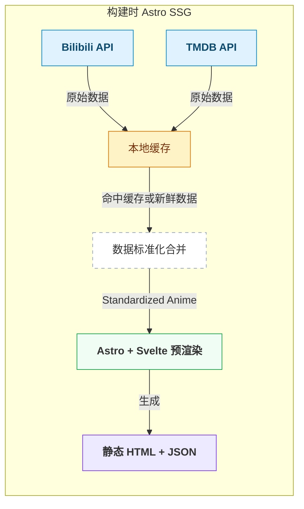

## 前言

作为一个二次元爱好者，你是否想过在自己的博客上展示追番记录？这篇博客将从零开始为你提供一套完整的**追番功能**，支持从 **Bilibili** 和 **TMDB** 双数据源自动同步追番数据，并以精美的卡片网格展示。

本文将从架构设计、数据获取、组件实现到配置部署，全方位解析这个功能的实现细节。

---

## 一、功能概览

Firefly 主题的追番功能实际上包含**两个独立但相关的特性**：

| 特性 | 路由 | 数据源 | 用途 |
|------|------|--------|------|
| **番组计划 (Bangumi)** | `/bangumi/` | Bangumi (bgm.tv) | 展示动漫、书籍、音乐、游戏等多媒体收藏 |
| **追番 (Anime)** | `/anime/` | Bilibili + TMDB | 专注动漫追番，双源合并展示 |

两个功能均可通过配置独立开关控制，互不影响。

### 追番页面核心功能

- 🔍 **实时搜索** — 按标题模糊搜索
- 🎬 **类型筛选** — TV 动画 / 剧场版一键切换
- 📊 **智能排序** — 按评分或日期升降序排列
- 📄 **分页浏览** — 客户端分页，流畅无刷新
- 🎨 **详情弹窗** — 点击卡片查看完整信息，一键跳转观看
- 🌐 **双源合并** — Bilibili 和 TMDB 数据自动去重合并

---

## 二、架构设计

### 2.1 整体架构



### 2.2 技术栈选型

| 层级 | 技术 | 选型理由 |
|------|------|---------|
| 页面框架 | Astro | 静态站点生成，构建时获取数据 |
| 交互组件 | Svelte 5 (Runes) | 响应式状态管理，轻量高效 |
| 数据源 1 | Bilibili API | 获取用户追番列表及观看进度 |
| 数据源 2 | TMDB API | 获取详细影视信息和评分 |
| 类型系统 | TypeScript | 统一数据接口，类型安全 |

### 2.3 文件结构

```
src/
├── types/
│   └── anime.ts                    # StandardizedAnime 接口定义
├── config/
│   └── siteConfig.ts               # 追番配置（Bilibili UID / TMDB Key）
├── pages/
│   └── anime.astro                 # 页面入口，数据获取与合并逻辑
└── components/pages/anime/
    ├── AnimeGrid.svelte            # 主网格组件（搜索/筛选/排序/分页）
    ├── AnimeCard.svelte            # 单个番剧卡片
    └── AnimeDetailModal.svelte     # 详情弹窗组件
```

---

## 三、数据模型设计

为了让来自不同数据源的番剧数据能够统一处理，我们设计了 `StandardizedAnime` 标准化接口：

```typescript
// src/types/anime.ts
export interface StandardizedAnime {
  id: number;              // 唯一标识（TMDB ID 或 Bilibili media_id）
  title: string;           // 中文标题
  originalTitle: string;   // 原始标题（日文/英文）
  poster: string | null;   // 海报 URL
  type: "tv" | "movie";   // 类型：TV 动画 / 剧场版
  source: "tmdb" | "bilibili"; // 数据来源
  rating: number;          // 评分（0-10）
  date: string;            // 发布日期（YYYY-MM-DD）
  overview: string;        // 剧情简介
  link: string;            // 详情/播放链接
  epStatus: string | undefined; // 集数状态（仅 Bilibili 数据有此字段）
}
```

这个接口的设计有几个关键考量：

1. **`source` 字段** — 标记数据来源，用于 UI 展示不同的来源标签和颜色
2. **`epStatus` 字段** — 仅 Bilibili 数据包含观看进度，TMDB 数据为 `undefined`
3. **`poster` 可空** — Bilibili 部分番剧可能缺少海报，需要做空值处理

---

## 四、构建时数据获取

追番数据在**构建时**（SSR）获取，而非运行时。这意味着每次部署时会自动同步最新数据。

### 4.1 Bilibili 数据获取

```typescript
// 从 Bilibili API 获取用户追番列表（分页）
async function fetchBilibiliData(uid: string): Promise<any[]> {
  const items: any[] = [];
  let page = 1;
  const pageSize = 30;
  const maxPages = 20; // 最多获取 20 页

  while (page <= maxPages) {
    const response = await fetch(
      `https://api.bilibili.com/x/space/bangumi/follow/list` +
      `?type=1&vmid=${uid}&pn=${page}&ps=${pageSize}`
    );
    const data = await response.json();

    if (data?.data?.list?.length > 0) {
      items.push(...data.data.list);
      if (data.data.list.length < pageSize) break; // 最后一页
      page++;
    } else {
      break;
    }
  }

  return items;
}
```

### 4.2 TMDB 数据获取

```typescript
// 从 TMDB API 获取自定义列表（支持多页）
async function fetchTMDBData(apiKey: string, listId: string): Promise<any[]> {
  const firstResponse = await fetch(
    `https://api.themoviedb.org/3/list/${listId}` +
    `?api_key=${apiKey}&language=zh-CN&page=1`
  );
  const firstData = await firstResponse.json();
  const totalPages = firstData.total_pages || 1;
  let allItems = [...(firstData.items || [])];

  // 并行获取剩余页面
  if (totalPages > 1) {
    const promises = [];
    for (let page = 2; page <= totalPages; page++) {
      promises.push(
        fetch(
          `https://api.themoviedb.org/3/list/${listId}` +
          `?api_key=${apiKey}&language=zh-CN&page=${page}`
        )
          .then(res => res.json())
          .then(data => data.items || [])
      );
    }
    const remainingItems = await Promise.all(promises);
    remainingItems.forEach(items => allItems.push(...items));
  }

  return allItems;
}
```

> 💡 **容错机制**：当 TMDB API 请求失败时，会自动降级读取本地缓存文件 `public/anime-list.json`，确保构建不会因网络问题而中断。

### 4.3 数据标准化与合并

两个数据源的原始格式完全不同，需要分别进行标准化处理，然后合并去重：

```typescript
// 标准化 Bilibili 数据
const bilibiliStandardized: StandardizedAnime[] = bilibiliItems.map(item => ({
  id: item.media_id,
  title: item.title,
  originalTitle: item.season?.title || item.title,
  poster: item.cover || null,
  type: "tv" as const,
  source: "bilibili" as const,
  rating: item.rating || 0,
  date: item.season?.new_ep?.pub_date || "",
  overview: item.season?.evaluate || "",
  link: `https://www.bilibili.com/bangumi/media/md${item.media_id}/`,
  epStatus: item.new_ep?.index_show || undefined,
}));

// 标准化 TMDB 数据
const tmdbStandardized: StandardizedAnime[] = tmdbItems.map(item => ({
  id: item.id,
  title: item.title || item.name,
  originalTitle: item.original_title || item.original_name,
  poster: item.poster_path ? `${TMDB_IMG}${item.poster_path}` : null,
  type: (item.media_type === "movie" ? "movie" : "tv") as const,
  source: "tmdb" as const,
  rating: item.vote_average || 0,
  date: item.release_date || item.first_air_date || "",
  overview: item.overview || "",
  link: `https://www.themoviedb.org/${item.media_type}/${item.id}`,
  epStatus: undefined,
}));

// 合并去重：Bilibili 数据优先（包含观看进度）
const titleMap = new Map<string, StandardizedAnime>();
for (const item of tmdbStandardized) {
  titleMap.set(item.title, item);
}
for (const item of bilibiliStandardized) {
  titleMap.set(item.title, item); // Bilibili 覆盖同名 TMDB 条目
}
const allAnime = Array.from(titleMap.values());
```

合并策略的核心思想：**当标题相同时，Bilibili 数据优先**，因为它包含用户实际的观看进度信息。

---

## 五、Svelte 5 交互组件

追番页面的核心交互由三个 Svelte 5 组件实现，充分利用了 Svelte 5 的 Runes 响应式系统。

### 5.1 主网格组件 — AnimeGrid.svelte

这是页面的主控组件，负责搜索、筛选、排序和分页的状态管理：

```svelte
<script lang="ts">
  import type { StandardizedAnime } from "@/types/anime";
  import AnimeCard from "./AnimeCard.svelte";
  import AnimeDetailModal from "./AnimeDetailModal.svelte";

  let { animeList, buildTime }: {
    animeList: StandardizedAnime[];
    buildTime: string;
  } = $props();

  // 响应式状态
  let searchQuery = $state("");
  let typeFilter = $state<"all" | "tv" | "movie">("all");
  let sortOrder = $state<"rating-desc" | "rating-asc" | "date-desc" | "date-asc">("rating-desc");
  let currentPage = $state(1);
  let selectedAnime = $state<StandardizedAnime | null>(null);
  const pageSize = 12;

  // 派生状态：过滤后的列表
  let filteredList = $derived.by(() => {
    let list = animeList;

    // 搜索过滤
    if (searchQuery) {
      const q = searchQuery.toLowerCase();
      list = list.filter(item =>
        item.title.toLowerCase().includes(q) ||
        item.originalTitle.toLowerCase().includes(q)
      );
    }

    // 类型过滤
    if (typeFilter !== "all") {
      list = list.filter(item => item.type === typeFilter);
    }

    // 排序
    const sorted = [...list];
    switch (sortOrder) {
      case "rating-desc": sorted.sort((a, b) => b.rating - a.rating); break;
      case "rating-asc":  sorted.sort((a, b) => a.rating - b.rating); break;
      case "date-desc":   sorted.sort((a, b) => b.date.localeCompare(a.date)); break;
      case "date-asc":    sorted.sort((a, b) => a.date.localeCompare(b.date)); break;
    }

    return sorted;
  });

  // 派生状态：当前页数据
  let pagedList = $derived(
    filteredList.slice((currentPage - 1) * pageSize, currentPage * pageSize)
  );
  let totalPages = $derived(Math.ceil(filteredList.length / pageSize));

  // 搜索或筛选变化时重置到第一页
  $effect(() => {
    searchQuery; typeFilter; sortOrder;
    currentPage = 1;
  });
</script>
```

### 5.2 卡片组件 — AnimeCard.svelte

每个番剧卡片展示海报、评分、类型标签和来源标识：

```svelte
<script lang="ts">
  import type { StandardizedAnime } from "@/types/anime";

  let { anime, onSelect }: {
    anime: StandardizedAnime;
    onSelect: (anime: StandardizedAnime) => void;
  } = $props();
</script>

<article
  class="group relative overflow-hidden rounded-xl bg-zinc-100 dark:bg-zinc-800
         cursor-pointer transition-transform hover:scale-[1.02]"
  onclick={() => onSelect(anime)}
>
  <!-- 海报 -->
  <div class="aspect-[2/3] overflow-hidden">
    {#if anime.poster}
      
    {:else}
      <div class="flex h-full items-center justify-center bg-zinc-200 dark:bg-zinc-700">
        <span class="text-zinc-400">暂无海报</span>
      </div>
    {/if}
  </div>

  <!-- 评分徽章 -->
  {#if anime.rating > 0}
    <div class="absolute top-2 right-2 rounded-full bg-black/70 px-2 py-1
                text-sm font-bold text-yellow-400 backdrop-blur-sm">
      ⭐ {anime.rating.toFixed(1)}
    </div>
  {/if}

  <!-- 类型标签 -->
  <div class="absolute top-2 left-2 rounded-full px-2 py-0.5 text-xs font-medium
              {anime.type === 'tv' ? 'bg-blue-500/80 text-white' : 'bg-purple-500/80 text-white'}">
    {anime.type === 'tv' ? 'TV' : '剧场版'}
  </div>

  <!-- 来源标签 -->
  <div class="absolute bottom-2 left-2 rounded-full px-2 py-0.5 text-xs font-medium
              {anime.source === 'bilibili' ? 'bg-pink-500/80 text-white' : 'bg-emerald-500/80 text-white'}">
    {anime.source === 'bilibili' ? 'Bilibili' : 'TMDB'}
  </div>

  <!-- 标题覆盖层 -->
  <div class="absolute bottom-0 inset-x-0 bg-gradient-to-t from-black/80 to-transparent p-3">
    <h3 class="text-sm font-semibold text-white line-clamp-2">{anime.title}</h3>
  </div>
</article>
```

### 5.3 详情弹窗 — AnimeDetailModal.svelte

点击卡片后弹出的详情弹窗，展示完整信息并提供跳转链接：

```svelte
<script lang="ts">
  import type { StandardizedAnime } from "@/types/anime";

  let { anime, onClose }: {
    anime: StandardizedAnime | null;
    onClose: () => void;
  } = $props();

  // ESC 键关闭
  function handleKeydown(e: KeyboardEvent) {
    if (e.key === "Escape") onClose();
  }
</script>

<svelte:window on:keydown={handleKeydown} />

{#if anime}
  <!-- 背景遮罩 -->
  <div
    class="fixed inset-0 z-50 flex items-center justify-center bg-black/60 backdrop-blur-sm"
    onclick={onClose}
  >
    <!-- 弹窗内容 -->
    <div
      class="relative mx-4 max-h-[90vh] max-w-2xl overflow-auto rounded-2xl
             bg-white p-6 shadow-2xl dark:bg-zinc-900 animate-in"
      onclick={(e) => e.stopPropagation()}
    >
      <div class="flex flex-col sm:flex-row gap-6">
        <!-- 海报 -->
        {#if anime.poster}
          
        {/if}

        <!-- 信息 -->
        <div class="flex-1 space-y-3">
          <h2 class="text-2xl font-bold">{anime.title}</h2>
          {#if anime.originalTitle !== anime.title}
            <p class="text-zinc-500">{anime.originalTitle}</p>
          {/if}

          <!-- 徽章组 -->
          <div class="flex flex-wrap gap-2">
            <span class="rounded-full ...">
              {anime.type === 'tv' ? 'TV 动画' : '剧场版'}
            </span>
            {#if anime.rating > 0}
              <span class="rounded-full ...">⭐ {anime.rating.toFixed(1)}</span>
            {/if}
            {#if anime.epStatus}
              <span class="rounded-full ...">📺 {anime.epStatus}</span>
            {/if}
          </div>

          {#if anime.overview}
            <p class="text-sm text-zinc-600 dark:text-zinc-400 line-clamp-6">
              {anime.overview}
            </p>
          {/if}

          <!-- 操作按钮 -->
          <a href={anime.link} target="_blank" rel="noopener noreferrer"
             class="inline-block rounded-lg bg-blue-500 px-4 py-2 text-white
                    hover:bg-blue-600 transition-colors">
            {anime.source === 'bilibili' ? '立即观看' : '查看 TMDB 详情'}
          </a>
        </div>
      </div>
    </div>
  </div>
{/if}
```

---

## 六、配置与使用

### 6.1 基础配置

在 `src/config/siteConfig.ts` 中配置追番功能：

```typescript
// 追番配置（Bilibili + TMDB）
anime: {
  // Bilibili 配置（必填）
  bilibili: {
    uid: "442980782", // 你的 Bilibili 用户 UID
  },
  // TMDB 配置（可选，需要网络访问 TMDB）
  tmdb: {
    apiKey: "your_tmdb_api_key", // TMDB API v3 密钥
    listId: "your_list_id",       // TMDB 自定义列表 ID
  },
},

// 页面开关
pages: {
  anime: true,  // 启用追番页面
},
```

### 6.2 如何获取配置信息

**Bilibili UID：**

1. 登录 Bilibili，进入个人主页
2. URL 中的数字即为 UID，例如 `https://space.bilibili.com/442980782`
3. 确保你的追番列表为**公开**状态

**TMDB API Key：**

1. 注册 [TMDB](https://www.themoviedb.org/) 账号
2. 进入 API 设置页面申请 API Key
3. 创建一个自定义列表，记录列表 ID

### 6.3 TMDB 本地缓存

由于 TMDB 在国内需要翻墙访问，主题提供了本地缓存降级方案：

1. 首次成功获取 TMDB 数据后，将结果保存到 `public/anime-list.json`
2. 后续构建时如果 TMDB 请求失败，自动使用本地缓存
3. 建议定期更新缓存文件以保持数据新鲜

---

## 七、国际化支持

追番功能完整支持 5 种语言的国际化：

| 语言 | 页面标题 | 副标题 |
|------|---------|--------|
| 简体中文 | 追番 | 记录我的二次元之旅 |
| 繁体中文 | 追番 | 記錄我的二次元之旅 |
| 英语 | Anime | Track my anime journey |
| 日语 | アニメ追跡 | 私のアニメの旅を記録 |
| 俄语 | Аниме | Отслеживание моего аниме-пути |

所有 UI 文本（筛选按钮、排序选项、空状态提示等）均通过 i18n 系统管理。

---

## 八、导航集成

追番页面自动集成到导航栏的「我的」下拉菜单中，显示条件由配置开关控制：

```typescript
// src/config/navBarConfig.ts
if (siteConfig.pages.anime) {
  items.push({
    name: i18n(I18nKey.anime),
    url: "/anime/",
    icon: "material-symbols:live-tv",
  });
}
```

---

## 九、与番组计划的对比

| 维度 | 追番 (Anime) | 番组计划 (Bangumi) |
|------|-------------|-------------------|
| 数据源 | Bilibili + TMDB | Bangumi (bgm.tv) |
| 覆盖范围 | 仅动漫 | 动漫、书籍、音乐、游戏、真人 |
| 交互组件 | Svelte 5 | Astro + 原生 JS |
| 搜索/排序 | ✅ 支持 | ❌ 不支持 |
| 详情弹窗 | ✅ 支持 | ❌ 不支持 |
| 观看进度 | ✅ 显示 | ✅ 显示 |
| 评分来源 | TMDB / Bilibili | Bangumi 社区评分 |

两个功能互补：**追番页面**专注于动漫追番体验，提供丰富的交互功能；**番组计划**则是全面的多媒体收藏展示。

---

## 十、总结

Firefly 主题的追番功能展示了如何将多个外部数据源整合到一个统一的展示界面中。关键技术点包括：

1. **构建时数据获取** — 利用 Astro 的 SSR 能力，在构建阶段完成 API 调用，避免运行时网络依赖
2. **数据标准化** — 通过统一接口抽象不同数据源的差异
3. **Svelte 5 Runes** — 使用 `$state`、`$derived`、`$effect` 实现声明式响应式状态管理
4. **降级容错** — TMDB 请求失败时自动使用本地缓存
5. **去重合并** — 以标题为键进行去重，Bilibili 数据优先保留观看进度

如果你也在使用 Firefly 主题，只需简单配置 Bilibili UID，就能拥有一个精美的追番展示页面。加上可选的 TMDB 配置，还能获取更丰富的影视信息和评分数据。

---

> 📌 **相关文件索引**
>
> | 文件 | 说明 |
> |------|------|
> | `src/config/siteConfig.ts` | 追番配置入口 |
> | `src/types/anime.ts` | StandardizedAnime 接口定义 |
> | `src/pages/anime.astro` | 页面入口与数据获取逻辑 |
> | `src/components/pages/anime/AnimeGrid.svelte` | 主网格交互组件 |
> | `src/components/pages/anime/AnimeCard.svelte` | 番剧卡片组件 |
> | `src/components/pages/anime/AnimeDetailModal.svelte` | 详情弹窗组件 |
> | `src/i18n/languages/zh_CN.ts` | 中文翻译 |
