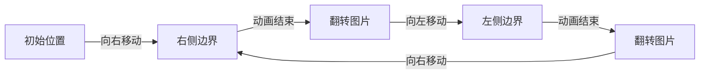

## 前言

想让你的博客更有生机吗？添加一个可爱的桌宠（Desktop Pet）特效是个不错的选择！本教程将手把手教你如何在 Firefly 主题中实现一个可以在页面底部左右走动的桌宠。

添加成功后，你会看到一个可爱的小角色在你的博客页面底部来回走动，为访客增添乐趣。

---

## 一、效果预览

实现完成后，桌宠会在页面底部：

- 🚶 **左右走动** — 从左侧走到右侧，再从右侧走回左侧
- 🔄 **自动转向** — 移动时始终面向移动方向
- 🖱️ **点击互动** — 点击桌宠会触发跳跃动画
- ⏸️ **窗口适配** — 根据窗口宽度自动计算移动距离

---

## 二、实现原理

### 2.1 技术栈

| 技术 | 用途 |
|------|------|
| **Astro 组件** | 封装桌宠为可复用组件 |
| **CSS Animation** | 实现平滑的左右移动动画 |
| **JavaScript** | 动态计算动画参数和处理交互 |
| **TypeScript 类型** | 配置系统的类型安全 |

### 2.2 动画原理

桌宠移动的核心是 **CSS Keyframes 动画**：

1. 创建两个方向的动画（向右移动、向左移动）
2. 动画结束时通过 `animationend` 事件切换方向
3. 使用 `transform: scaleX()` 实现图片水平翻转



---

## 三、文件结构

实现桌宠功能需要创建以下文件：

```
src/
├── assets/
│   └── images/
│       └── zc.gif                    # 桌宠图片资源
├── components/
│   └── features/
│       └── DesktopPet.astro          # 桌宠组件
├── config/
│   └── desktopPetConfig.ts           # 桌宠配置文件
├── types/
│   └── config.ts                     # 类型定义（修改）
└── layouts/
    └── MainGridLayout.astro          # 主布局（修改）
```

---

## 四、详细实现步骤

### 步骤 1：准备桌宠图片

首先，你需要准备一个桌宠 GIF 图片。建议：

- 使用透明背景的 GIF
- 图片宽度在 80-100 像素之间
- 选择走路循环动画

将图片放在 `src/assets/images/zc.gif`。

### 步骤 2：添加类型定义

在 `src/types/config.ts` 中添加桌宠配置类型：

```typescript
// 桌宠配置
export type DesktopPetConfig = {
  enable: boolean; // 是否启用桌宠功能
  petWidth?: number; // 桌宠图片宽度（像素），默认 86
  speed?: number; // 移动速度（像素/秒），默认 100
  opacity?: number; // 桌宠透明度（0-1），默认 0.9
  bottom?: number; // 距离页面底部的偏移量（像素），默认 0
};
```

### 步骤 3：创建配置文件

创建 `src/config/desktopPetConfig.ts`：

```typescript
import type { DesktopPetConfig } from "../types/config";

export const desktopPetConfig: DesktopPetConfig = {
  // 是否启用桌宠功能
  enable: true,

  // 桌宠图片宽度（像素），用于计算移动边界
  petWidth: 86,

  // 移动速度（像素/秒），值越大移动越快
  speed: 100,

  // 桌宠透明度（0-1）
  opacity: 0.9,

  // 距离页面底部的偏移量（像素）
  bottom: 0,
};
```

### 步骤 4：创建桌宠组件

创建 `src/components/features/DesktopPet.astro`：

```astro
---
// 桌宠组件 - 在页面底部左右走动的可爱宠物
import { desktopPetConfig } from "@/config/desktopPetConfig";

interface Props {
  class?: string;
}

const { class: className } = Astro.props;
const config = desktopPetConfig;

// 如果桌宠功能未启用，不渲染任何内容
if (!config.enable) {
  return;
}

// 导入桌宠图片
import petGif from "@/assets/images/zc.gif";
---

<div
  id="desktop-pet"
  class:list={["desktop-pet-container", className]}
  data-speed={config.speed || 100}
  data-pet-width={config.petWidth || 86}
  data-opacity={config.opacity || 0.9}
  data-bottom={config.bottom || 0}
>
  
</div>

<style>
  .desktop-pet-container {
    position: fixed;
    z-index: 999999;
    pointer-events: none;
  }

  .desktop-pet-img {
    position: fixed;
    z-index: 999999;
    bottom: 0;
    left: -100px;
    opacity: 0.9;
    transform: scaleX(-1);
    animation-direction: alternate;
    animation-timing-function: linear;
    pointer-events: auto;
    cursor: pointer;
    user-select: none;
    -webkit-user-drag: none;
  }

  /* 点击动画效果 */
  .desktop-pet-img.pet-clicked {
    animation: petJump 0.5s ease-in-out;
  }

  @keyframes petJump {
    0%, 100% {
      transform: scaleX(-1) translateY(0);
    }
    50% {
      transform: scaleX(-1) translateY(-20px);
    }
  }
</style>
```

### 步骤 5：实现移动逻辑

在组件的 `<script>` 部分添加 JavaScript 逻辑：

```javascript
// 桌宠移动逻辑
function initDesktopPet() {
  const petContainer = document.getElementById("desktop-pet");
  const petImg = document.getElementById("desktop-pet-img");

  if (!petContainer || !petImg) return;

  // 获取配置参数
  const speed = parseInt(petContainer.getAttribute("data-speed") || "100");
  const petWidth = parseInt(petContainer.getAttribute("data-pet-width") || "86");
  const opacity = parseFloat(petContainer.getAttribute("data-opacity") || "0.9");
  const bottom = parseInt(petContainer.getAttribute("data-bottom") || "0");

  // 设置样式
  petImg.style.opacity = opacity.toString();
  petImg.style.bottom = `${bottom}px`;

  // 动态创建样式标签用于动画
  const styleTag = document.createElement("style");
  styleTag.id = "desktop-pet-css";
  document.head.appendChild(styleTag);

  let w1 = document.body.scrollWidth;
  let leftStart = 0 - petWidth;
  let leftEnd = w1 - petWidth;
  let time = Math.floor(w1 / speed);
  let fx = "r"; // 方向：r=右，l=左
  let isFirst = true;

  // 移动桌宠
  function movePet(direction) {
    if (!isFirst) {
      leftStart = 0;
    }

    if (direction === "r") {
      petImg.style.transform = "scaleX(-1)";
      styleTag.innerHTML = `
        @keyframes desktopPetMove {
          from { left: ${leftStart}px }
          to   { left: ${leftEnd}px }
        }
      `;
      petImg.style.animationName = "desktopPetMove";
      petImg.style.animationDuration = `${time}s`;
    } else {
      petImg.style.transform = "scaleX(1)";
      styleTag.innerHTML = `
        @keyframes desktopPetMove2 {
          from { left: ${leftEnd}px }
          to   { left: ${leftStart}px }
        }
      `;
      petImg.style.animationName = "desktopPetMove2";
      petImg.style.animationDuration = `${time}s`;
    }
  }

  // 动画结束时切换方向
  petImg.addEventListener("animationend", () => {
    isFirst = false;
    fx = fx === "r" ? "l" : "r";
    movePet(fx);
  });

  // 点击桌宠时的互动效果
  petImg.addEventListener("click", () => {
    petImg.classList.add("pet-clicked");
    setTimeout(() => {
      petImg.classList.remove("pet-clicked");
    }, 500);
  });

  // 窗口大小变化时重新计算
  window.addEventListener("resize", () => {
    w1 = document.body.scrollWidth;
    leftEnd = w1 - petWidth;
    time = Math.floor(w1 / speed);
  });

  // 开始移动
  movePet(fx);
}

// 页面加载时初始化
if (document.readyState === "loading") {
  document.addEventListener("DOMContentLoaded", initDesktopPet);
} else {
  initDesktopPet();
}

// 支持 Astro 的页面切换
document.addEventListener("astro:page-load", initDesktopPet);
```

### 步骤 6：集成到布局

在 `src/layouts/MainGridLayout.astro` 中集成桌宠组件：

```astro
---
// 导入桌宠组件
import DesktopPet from "@components/features/DesktopPet.astro";
// ... 其他导入
---

<!-- 在布局底部添加桌宠 -->
<SpineModel></SpineModel>
{live2dWidgetConfig.enable && <Live2DWidget config={live2dWidgetConfig} />}
<DesktopPet />
```

### 步骤 7：导出配置

在 `src/config/index.ts` 中添加导出：

```typescript
// 类型导出
export type {
  // ... 其他类型
  DesktopPetConfig, // 添加这行
} from "../types/config";

// 配置导出
export { desktopPetConfig } from "./desktopPetConfig"; // 添加这行
```

---

## 五、配置说明

| 参数 | 类型 | 默认值 | 说明 |
|------|------|--------|------|
| `enable` | `boolean` | `true` | 是否启用桌宠功能 |
| `petWidth` | `number` | `86` | 桌宠图片宽度（像素） |
| `speed` | `number` | `100` | 移动速度（像素/秒） |
| `opacity` | `number` | `0.9` | 桌宠透明度（0-1） |
| `bottom` | `number` | `0` | 距离页面底部偏移量（像素） |

### 配置示例

```typescript
// 快速移动的桌宠
export const desktopPetConfig: DesktopPetConfig = {
  enable: true,
  speed: 200,        // 200像素/秒
  opacity: 0.8,
};

// 慢悠悠的桌宠
export const desktopPetConfig: DesktopPetConfig = {
  enable: true,
  speed: 50,         // 50像素/秒
  bottom: 10,        // 距底部10像素
};
```

---

## 六、技术细节

### 6.1 动画计算公式

```javascript
// 移动时间 = 页面宽度 / 速度
time = Math.floor(document.body.scrollWidth / speed);

// 向右移动：从 -petWidth 到 (页面宽度 - petWidth)
leftStart = 0 - petWidth;
leftEnd = document.body.scrollWidth - petWidth;
```

### 6.2 方向切换机制

使用 `animationend` 事件监听动画结束，然后切换方向：

```javascript
petImg.addEventListener("animationend", () => {
  fx = fx === "r" ? "l" : "r";  // 切换方向
  movePet(fx);                    // 开始新动画
});
```

### 6.3 图片翻转

使用 CSS `transform: scaleX()` 实现图片水平翻转：

```javascript
// 向右移动时：图片水平翻转（面向右）
petImg.style.transform = "scaleX(-1)";

// 向左移动时：原始方向（面向左）
petImg.style.transform = "scaleX(1)";
```

---

## 七、故障排除

### 桌宠不显示

1. 检查配置文件中 `enable` 是否为 `true`
2. 确认图片路径正确
3. 检查浏览器控制台是否有错误

### 桌宠移动异常

1. 检查 `petWidth` 是否与图片实际宽度匹配
2. 尝试调整 `speed` 值
3. 确认页面没有其他元素干扰

### 点击无反应

1. 检查 CSS 中 `pointer-events` 设置
2. 确认 JavaScript 代码正确加载

---

## 八、自定义建议

### 更换桌宠图片

将你喜欢的 GIF 图片放在 `src/assets/images/` 目录下，然后修改组件中的导入路径：

```astro
import petGif from "@/assets/images/your-pet.gif";
```

### 添加更多互动

可以扩展点击事件，添加更多互动效果：

```javascript
// 双击彩蛋
petImg.addEventListener("dblclick", () => {
  // 显示对话框
  showPetDialog("你好呀！");
});
```

### 多桌宠支持

通过复制组件并修改 ID，可以实现多个桌宠同时出现。

---

## 九、参考资料

- [CSS Animation 文档](https://developer.mozilla.org/zh-CN/docs/Web/CSS/CSS_animations)
- [Astro 组件文档](https://docs.astro.build/zh-cn/core-concepts/astro-components/)
- [使用CSS3动画制作页面底部走动的桌宠](https://saber.love)

---

## 总结

通过本教程，你已经学会了如何为博客添加一个可爱的桌宠特效。这个功能虽然简单，但涉及了：

- **Astro 组件设计** — 可复用、可配置
- **CSS 动画** — Keyframes 和 transform
- **JavaScript 事件处理** — 动画控制和用户交互
- **TypeScript 类型系统** — 配置的类型安全

希望这个小桌宠能为你的博客增添一份生机和乐趣！🎉
