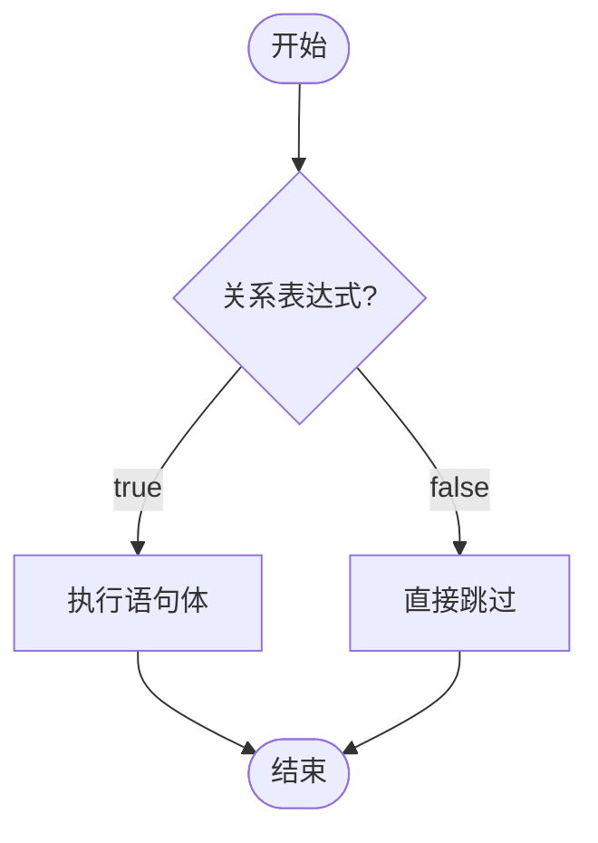
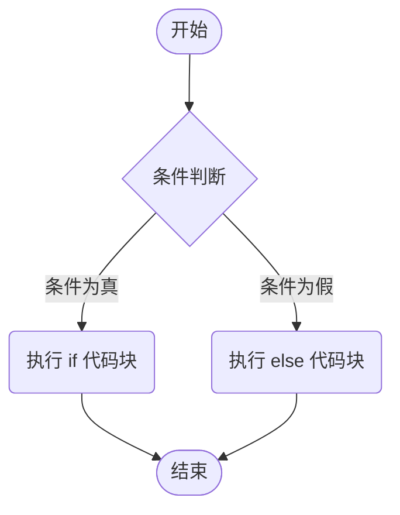
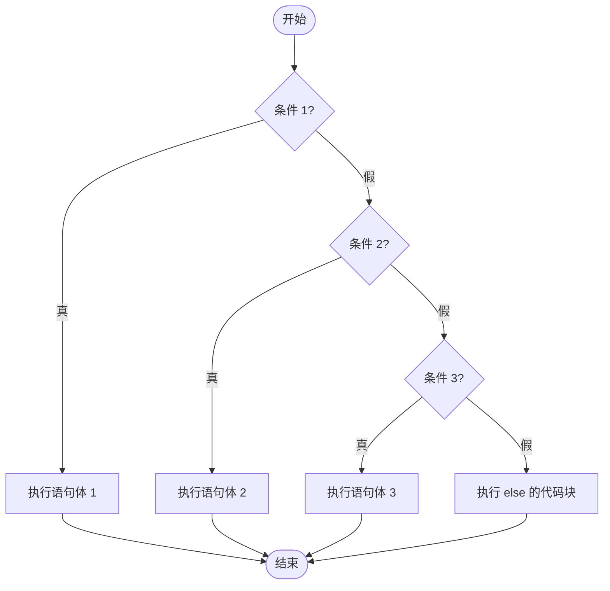
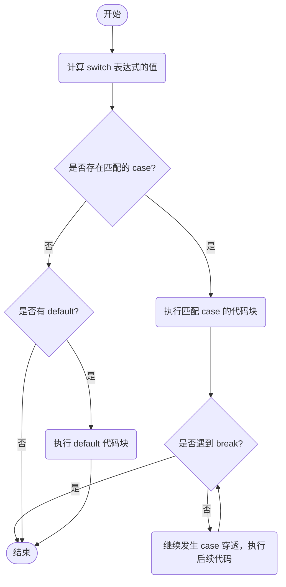
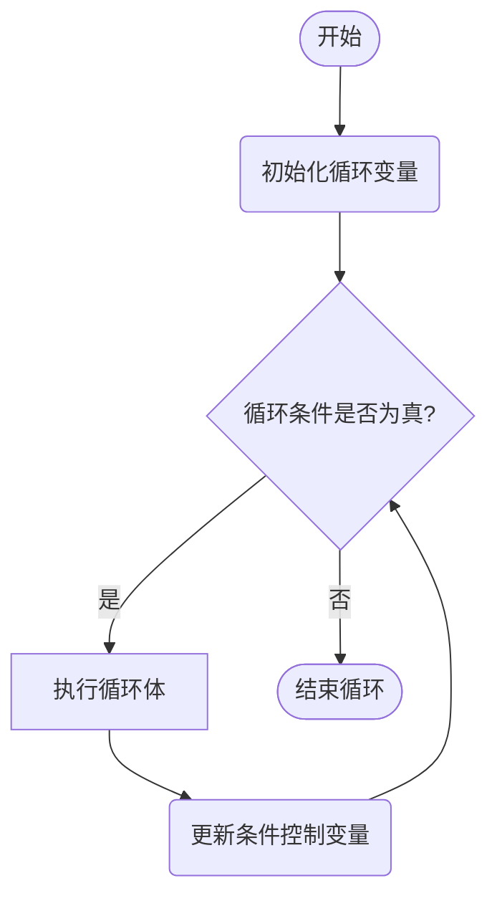
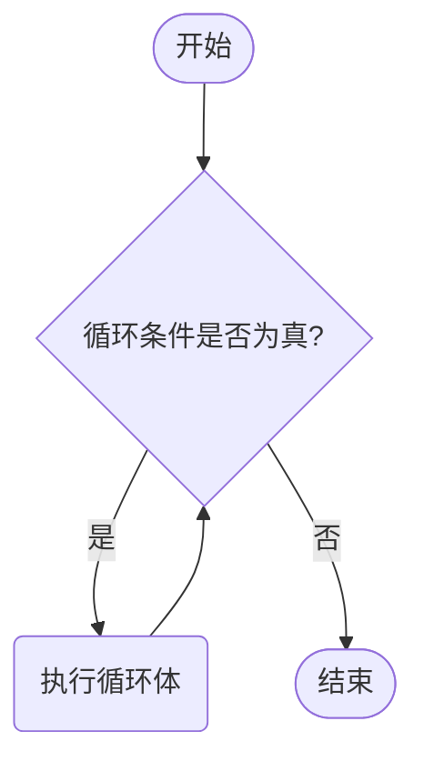
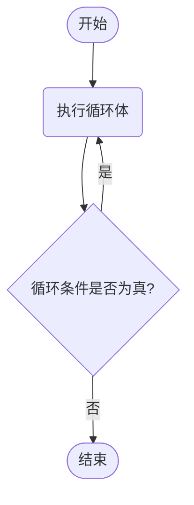

# 一、流程控制语句
## 一、if 判断结构
### 1、if 语句格式 1（单分支）
```java
if (关系表达式) {
    语句体;	
}
```
- **执行走向:**

- **隐藏细节**

1. 如果对一个 `boolean` 类型的变量进行真假判断，严禁写 == `true`，直接将变量放入小括号中即可。
2.<span style="background:#fdbfff"> 如果 `if` 语句块中只有一条语句，可以省略大括号 `{}`，但它只控制紧随其后的那一行代码（开发中**强烈不建议省略**）。</span>

- **<font color="#8064a2">实战演练 1：电商满减优惠券校验</font>**
```java
// 需求：键盘录入购物车总价，若大于等于 200 元，则享受满减，输出“成功使用满减优惠券！”
Scanner sc = new Scanner(System.in);
System.out.println("请输入您的订单总金额（元）：");
double totalMoney = sc.nextDouble();

if (totalMoney >= 200) {
	System.out.println("成功使用满减优惠券！结算金额自动减免 30 元。");
	}
```

### 2、if 语句格式 2（双分支）
```java
if (关系表达式) {
    语句体1;	
} else {
    语句体2;	
}
```
- **执行走向:**

- **<font color="#8064a2">实战演练 2：智能防盗门锁密码校验</font>**
```java
// 需求：键盘录入一个门锁密码，判断是否开锁成功
Scanner sc = new Scanner(System.in);
System.out.println("请输入智能锁的 6 位数字密码：");
String inputPassword = sc.next();

// ⚠️ 注意：在 Java 中比较两个字符串的内容是否相同，必须使用 equals() 方法！
if (inputPassword.equals("123456")) {
    System.out.println("密码验证成功，智能锁已打开！");
} else {
    System.out.println("密码错误，请注意安全防护，您还有 4 次输入机会。");
}
```

- **<font color="#8064a2">实战演练 3：图书馆选座系统</font>**
```java
// 需求：座位卡号范围为 1~500。其中偶数卡号在 A 区，奇数卡号在 B 区
Scanner sc = new Scanner(System.in);
System.out.println("请刷卡录入您的座位卡号（1~500）：");
int cardNum = sc.nextInt();

if (cardNum >= 1 && cardNum <= 500) {
    if (cardNum % 2 == 0) {
        System.out.println("卡号为偶数，请前往【自主学习 A 区】就座。");
    } else {
        System.out.println("卡号为奇数，请前往【多媒体讨论 B 区】就座。");
    }
} else {
    System.out.println("无效的卡号！请录入 1~500 范围内的合规座位号。");
}
```
### 3、if 语句格式 3（多分支）

```java
if (关系表达式1) {
    语句体1;	
} else if (关系表达式2) {
    语句体2;	
} ...
else {
    语句体n+1;
}
```


- **执行走向**：
    



- **<font color="#8064a2">实战演练 4：健身会员成长积分奖励</font>**
```java
    // 需求：根据会员当前累积的积分，判断其本月的会员等级并给予相应权益
    Scanner sc = new Scanner(System.in);
    System.out.println("请输入您当前的会员累积积分（正整数）：");
    int points = sc.nextInt();
    
    if (points >= 0) {
        if (points >= 10000) {
            System.out.println("尊贵的黑金 VIP 会员，享有私教 1对1 免费规划一次。");
        } else if (points >= 5000) {
            System.out.println("黄金 VIP 会员，享有免费健身特饮一包。");
        } else if (points >= 1000) {
            System.out.println("白银会员，享有免费储物柜租赁一次。");
        } else {
            System.out.println("普通会员，感谢您对本健身房的支持！");
        }
    } else {
        System.out.println("积分不合法，输入值需大于或等于 0");
    }
```
## 二、switch 选择语句
```java
switch (表达式) {
    case 值1:
        语句体1;
        break;
    case 值2:
        语句体2;
        break;
    ...
    default:
        语句体n+1;
        break;
}
```
- **执行走向**：


- **<font color="#8064a2">实战演练 5：每周运动</font>**

- **需求**：键盘录入星期数，显示今天的减肥活动。
    
    - 周一：跑步 
    - 周二：游泳
    - 周三：慢走
    - 周四：动感单车
    - 周五：拳击
    - 周六：爬山
    - 周日：好好吃一顿

```java
import java.util.Scanner;
**需求**：键盘录入星期数，显示今天的减肥活动。
- 周一：跑步	- 周二：游泳	- 周三：慢走	- 周四：动感单车
- 周五：拳击	- 周六：爬山	- 周日：好好吃一顿
public class SwitchDemo1 {
    public static void main(String[] args) {
        // 创建Scanner对象以读取用户输入
        Scanner sc = new Scanner(System.in);
        System.out.println("请输入星期一~星期日:");
        String week = sc.next();

        // 使用switch语句根据输入的星期数显示相应的减肥活动
        switch (week) {
            case "星期一":
                System.out.println("跑步");
                break;
            case "星期二":
                System.out.println("游泳");
                break;
            case "星期三":
                System.out.println("慢走");
                break;
            case "星期四":
                System.out.println("动感单车");
                break;
            case "星期五":
                System.out.println("拳击");
                break;
            case "星期六":
                System.out.println("爬山");
                break;
            case "星期日":
                System.out.println("好好吃一顿");
                break;
            default:
                System.out.println("输入错误!");
                break;
        }
    }
```
- **控制台运行输出结果**：
```bash
请输入星期一~星期日:
星期三
慢走
```
### 1、switch 基础知识
- **扩展知识：default 的位置和省略情况**
    
    - <span style="background: #b1ffff "> `default` 可以放在 `switch` 内部的**任意位置**（不一定必须写在最后面），也可以**完全省略**不写。</span>
        
- **switch 和 if 第三种格式各自的使用场景**
    
    - **`if` 语句格式 3 (if-else-if)**：当我们面临**需要对一个范围进行判断**的时候使用。
        
        - _示例_：小明的考试成绩。如果用 `switch`，你需要写 101 个 `case`（0~100），太麻烦了，而使用 `if` 进行区间范围判定则极其简单。
            
    - **`switch` 语句**：当我们把**有限个、具体离散的数据**列举出来，选择其中一个执行的时候使用。
        - _示例_：判断星期数（1-7）、月份（1-12），或者客服自助电话里 `0~9` 的功能选择。
### 2、穿透现象
- **原理与机制**：
    - <span style="background: #d3f8b6 "> 在 `switch` 语句中，如果某一个 `case` 匹配成功，且其语句体后面**没有书写 `break`**，程序就会引发 **case 穿透** 现象。</span>
        
    - **穿透机制**：不写 `break` 会引发 case 穿透。程序在执行完当前 case 的语句体后，将**不再判断**下一个 case 的条件是否匹配，直接无条件向下执行后续所有 case 或者是 default 的语句体，直到遇到 `break` 或者是整个 `switch` 结束。

- **<font color="#8064a2">实战演练：休息日和工作日 (传统穿透写法) </font>**    
    - **需求**：键盘录入星期数（1~7），输出该天是工作日还是休息日。其中 `1~5` 为工作日，`6~7` 为休息日。
```java
import java.util.Scanner;

public class SwitchPenetrationDemo {
    public static void main(String[] args) {
        // 分析：
        // 1.键盘录入星期数
        Scanner sc = new Scanner(System.in);
        System.out.println("请输入星期（1~7的整数）：");
        int week = sc.nextInt(); // 3
        
        // 2.利用case穿透简化代码
        switch (week){
            case 1:
            case 2:
            case 3:
            case 4:
            case 5:
                System.out.println("工作日");
                break;
            case 6:
            case 7:
                System.out.println("休息日");
                break;
            default:
                System.out.println("没有这个星期");
                break;
        }
    }
}
```
- **控制台运行输出结果**：
```bash
请输入星期（1~7的整数）：
3
工作日
```
### 3、Java 新特性
- **特性说明**：
    
    - 现代 Java (JDK 12+) 对 `switch` 进行了重大升级，引入了全新的**箭头语法（`->`）**。
        
    - 它不仅**天生杜绝了 case 穿透**，还可以将整个 `switch` 作为表达式直接返回值或进行赋值。
        
    - 针对大括号内的多行复杂代码块，还能通过 `yield` 关键字来返回值。
        
- **高级写法 A：极简单行返回值并直接赋值**
    
```java
int number = 3;
// 直接将 switch 表达式的计算结果赋予变量 result
String result = switch (number) {
	case 1 -> "一";
	case 2 -> "二";
	case 3 -> "三";
	default -> "其他"; // 作为表达式时，必须包含 default 分支以保障覆盖率，否则编译报错！
};
System.out.println(result);
```
    
- **高级写法 B：大括号复杂代码块与 `yield` 关键字返回**
    
```java
int number = 2;
String result = switch (number) {
	case 1 -> "一";
	case 2 -> {
		System.out.println("执行分支 2 对应的复杂处理逻辑...");
		yield "二"; // 在大括号代码块中，必须使用 yield 返回最终计算结果
	}
	default -> "其他";
};
System.out.println(result);
```
- **练习：休息日和工作日 (JDK 12 极简版)**
    - **需求**：利用 JDK 12+ 的箭头语法，在一行内实现多个 case 的合并与极简化输出。

```java
import java.util.Scanner;

public class SwitchNewFeatureDemo {
    public static void main(String[] args) {
        // 1.键盘录入星期数
        Scanner sc = new Scanner(System.in);
        System.out.println("请输入星期（1~7的整数）：");
        int week = sc.nextInt(); // 3

        // 2.利用JDK12简化代码书写
        switch (week) {
            case 1, 2, 3, 4, 5 -> System.out.println("工作日");
            case 6, 7 -> System.out.println("休息日");
            default -> System.out.println("没有这个星期");
        }
    }
}
```
- **控制台运行输出结果**：
```bash
请输入星期（1~7的整数）：
3
工作日
```

# 二、循环高级与数组

## 一、三种循环方式
### 1、for 循环
```java
for (初始化语句; 条件判断语句; 条件控制语句) {
    循环体语句;
}
```
**格式解释：**
- `初始化语句`：  用于表示循环<span style="background:rgba(240, 167, 216, 0.55)">开启时的起始状态</span>，简单说就是<span style="background:rgba(240, 167, 216, 0.55)">循环开始的时候什么样</span>
- `条件判断语句`：用于表示循环<span style="background: #d2cbff ">反复执行的条件</span>，简单说就是判断<span style="background: #d2cbff ">循环是否能一直执行下去</span>
- `循环体语句`：  用于表示循环<span style="background:rgba(240, 167, 216, 0.55)">反复执行的内容</span>，简单说就是<span style="background:rgba(240, 167, 216, 0.55)">循环反复执行的事情</span>
- `条件控制语句`：用于表示循环<span style="background:rgba(255, 183, 139, 0.55)">执行中每次变化的内容</span>，简单说就是<span style="background:rgba(255, 183, 139, 0.55)">控制循环是否能执行下去</span>

- **执行流程：**

- **<font color="#8064a2">实战演练 5：打印字符串</font>**
```java
//需求：打印5次HelloWorld
for (int i = 1; i <= 5; i++) {
    System.out.println("HelloWorld");
}
```
- **控制台运行输出结果：**
```bash
HelloWorld
HelloWorld
HelloWorld
HelloWorld
```

- **<font color=" #8064a2 "> 实战演练 6：输出 1-5 和 5-1 的数据</font>**
```java
//需求：输出数据1-5
        for(int i=1; i<=5; i++) {
			System.out.print(i);
		}
		//需求：输出数据5-1
		for(int i=5; i>=1; i--) {
			System.out.print(i);
		}
```
- **控制台运行输出结果**：
```bash
12345
54321
```

- **<font color="#8064a2">实战演练 6：1~100 之间 3 的倍数求和</font>**
```java
// 求和变量必须定义在循环体外部，防止循环体内重置
int sum = 0;
for (int i = 1; i <= 100; i++) {
    if (i % 3 == 0) {
        sum = sum + i;
    }
}
System.out.println("1~100 之间所有 3 的倍数的和是：" + sum);
```
- **控制台运行输出结果**：
```bash
1~100 之间所有 3 的倍数的和是：1683
```
### 2、while 循环
```java
初始化语句;
while(条件判断语句){
	循环体;
	条件控制语句;
}
```


- **<font color=" #8064a2 "> 实战演练 7：珠穆朗玛峰</font>**
```java
// 需求: 纸厚0.1毫米，对折翻倍。珠穆朗玛峰的高度约为8848米，对折多少次后厚度能够超过珠穆朗玛峰的高度？

//纸的厚度
double PaperHight = 0.1;
//珠穆朗玛峰的高度
double MountainHight = 8848.0;

//累计对折次数
double accumulate = 0;
//当纸的厚度小于等于珠穆朗玛峰的高度时，继续对折
while (PaperHight <= MountainHight) {

    //每次对折后，纸的厚度翻倍
    PaperHight = PaperHight * 2;
    //对折次数累计
    accumulate++;
}
//输出对折次数和最终纸的厚度
System.out.println("计算纸张对折" + accumulate + "次后，其厚度能够超过珠穆朗玛峰的高度" + "高度为:" + PaperHight);
```

### 3、do... while 循环
```java
初始化语句;
do{
    循环体;
    条件控制语句;
}while(条件判断语句);
```

**核心特点**：**无条件先执行一次循环体**，然后再进行条件判断。<span style="background:#fff88f">在实际企业项目开发中，使用率极低，属于了解知识。</span>


## 二、循环高级
### 一、无限循环

- **概念**：又叫死循环。循环一直停不下来。
    
#### 1、for 格式：
    
```java
for( ; ; ){
	System.out.println("循环执行一直在打印内容");
}
```

解释：

1. 初始化语句可以空着不写，表示循环之前不定义任何的控制变量。
	
2. 条件判断语句可以空着不写，如果不写，默认表示 `true`，循环一直进行。
	
3. 条件控制语句可以空着不写，表示每次循环体执行完毕后，控制变量不做任何变化。


#### 2、while 格式：
    
```java
while(true){
	System.out.println("循环执行一直在打印内容");
}
```   

  - 解释：小括号里面就不能省略了，`true` 一定要写出来，否则代码会报错。
#### 3、do... while 格式：
    
```java
do{
	System.out.println("循环执行一直在打印内容");
}while(true);
```

- **注意事项**：
    
    1. 最为常用的格式：`while`。
    2. <span style="background:#d2cbff">无限循环下面不能再写其他代码了，因为编译器判定它们永远执行不到，会直接报错.</span>
    3. `while` 和 `do...while`：小括号里面就不能省略 `true` ，否则代码会报错。

### 二. 条件控制语句

- **`break`**：跳出整个循环。
- **`continue`**：跳出本次循环。
#### 1、break:
    
- **原理**：不能单独存在。可以用在 `switch` 和循环中，<span style="background:rgba(173, 239, 239, 0.55)">表示结束、跳出的意思。</span>

- **<font color=" #8064a2 "> 实战演练 8: 装配流水线检测商-1</font>**
```java
// 模拟检测装配线上的 1~5 号产品，一旦检测到 3 号产品存在严重物理缺陷，
// 立刻强制停机并终止后续所有的检测流程。

for (int i = 1; i <= 5; i++) {
	System.out.println("正在检测装配线上的第 " + i + " 号产品...");
	if (i == 3) {
		System.out.println("【警告】发现 3 号产品存在严重缺陷！立刻强制停机！");
		break; // 立即跳出并终止整个循环
	}
}
```

- **控制台运行输出结果**：
```bash
正在检测装配线上的第 1 号产品...
正在检测装配线上的第 2 号产品...
正在检测装配线上的第 3 号产品...
【警告】发现 3 号产品存在严重缺陷！立刻强制停机！
```
#### 2、continue:

- **原理**：不能单独存在。只能存在于循环当中，表示：<span style="background:rgba(173, 239, 239, 0.55)">跳过本次循环</span>（<span style="background:rgba(173, 239, 239, 0.55)">当前循环中，后续的代码将不再执行</span>），<span style="background:rgba(173, 239, 239, 0.55)">直接去执行下一次循环</span>。

- **<font color=" #8064a2 "> 实战演练 9: 装配流水线检测商-2</font>**
```java
// 模拟精包装 1~5 号产品，当遇到有轻微划痕的 3 号产品时，
// 直接跳过其精包装工序，继续完成 4、5 号产品的精包装。

for (int i = 1; i <= 5; i++) {
	if (i == 3) {
		System.out.println("【提示】检测到 3 号产品轻微划痕，跳过本次精装工序。");
		continue; // 跳过本次循环体剩余的代码，直接开始下一次循环
	}
	System.out.println("成功完成第 " + i + " 号产品的精包装工序");
}
```
- **控制台运行输出结果**：
```bash
成功完成第 1 号产品的精包装工序
成功完成第 2 号产品的精包装工序
【提示】检测到 3 号产品轻微划痕，跳过本次精装工序。
成功完成第 4 号产品的精包装工序
成功完成第 5 号产品的精包装工序
```

### 三、Random 生成随机数

`Random` 跟 `Scanner` 一样，也是 Java 提前写好的类，我们<span style="background:rgba(205, 244, 105, 0.55)">不需要关心是如何实现的，只要直接使用就可以了</span>。
#### 1、使用步骤：

- 1. 导包
```java
import java.util.Random;
// 导包的动作必须出现在类定义的上边。
```

- 2. 创建对象
```java
Random r = new Random ();
// 上面这个格式里面，只有r是变量名，可以变，其他的都不允许变。
```

- 3. 生成随机数
```java
int number = r.nextInt(随机数的范围);
// 上面这个格式里面，只有number是变量名，可以变，其他的都不允许变。
// 随机数范围的特点：从0开始，不包含指定值。比如：参数为10，生成的范围[0,10)
```

**代码示例：**

```java
 // 1. 导包
import java.util.Random;
public class RandomDemo {
    public static void main(String[] args) {
     	// 2. 创建随机数生成对象
        Random r = new Random();

        // 3. 产生随机数：nextInt(范围参数)
        // 注意：随机数范围特点为 [0, 参数)，包左不包右（包头不包尾）
        int num = r.nextInt(100); // 随机生成 0 ~ 99 之间的整数
        System.out.println(num);
    }
}
```

- **<font color=" #8064a2 "> 实战演练 10: 猜数字小游戏</font>**
```java
public class guessTheNumbers {  
    public static void main(String[] args) {  
    
        int index = 5;  
        Scanner sc = new Scanner(System.in);  
        int number = (int) (Math.random() * 100 + 1);  
  
        System.out.println("请输入你猜的数字:");  
  
        while (index > 0) {  
            int input = sc.nextInt();  
            if (input == number) {  
                System.out.println("恭喜你,猜对了!");  
                break;  
            } else if (input < number) {  
                index--;  
                System.out.printf("猜小了,您还有%d次机会%n", index);  
            } else if (input > number) {  
                index--;  
                System.out.printf("猜大了,您还有%d次机会%n", index);  
            }  
            // 次数用完且未猜对时，给出提示  
            if (index == 0 && input != number) {  
                System.out.println("很遗憾，次数已用完！正确答案是: " + number);  
            }  
        }  
    }  
}
```
## 三、数组

### 1、数组概念与声明格式

- **概念**：一种容器，用来存储**同种数据类型**的多个值（在运算时支持数据类型隐式提升）。
    
- **格式一（行业首选）**：
```java
数据类型[] 数组名
int [] arr
```

- **格式二**：
```java
数据类型 数组名[];
int arr[]
```
### 2、数组静态初始化 

静态初始化会在声明数组时**直接手动指定数组的具体元素**，由系统在底层自动计算其长度。

- **完整格式**：
```java
数据类型[] 数组名 new 数据类型[]{元素1, 元素2, 元素3};
int[] arr new int[]{5, 8, 6, 3, 1 , 9}
```
 
- **简化格式（开发最高频）**：
```java
数据类型[] 数组名 = {元素1, 元素2, 元素3};
int[] arr{5, 8, 6, 3, 1 , 9}
```

### 3、地址值
⚠️ **不可变红线**：<span style="background:#ff4d4f">数组一旦在内存中创建完毕，其长度就绝对不能发生任何变化!</span>

- **数组地址值的打印细节**：
 
```java 
int[] arr = {1, 2, 3};
System.out.println(arr); // 输出形如: [I@6d03e736

// [ ：代表这是一个一维数组
// I ：代表数组内存储的元素是 int 类型
// @ ：作为地址值的分隔符
// 6d03e736 ：该数组在内存中真正存储的十六进制地址值
```

### 4、元素访问与索引

 **格式：**
 ```java
 数组名[索引];
 ```
​- **索引特征**：必定**从 0 开始**，连续不间断，最大索引为 `数组长度 - 1`（即 `arr.length - 1`）。
    
- **越界异常警告**：当访问了非正常范围的索引时，程序在运行期间会直接抛出 **`ArrayIndexOutOfBoundsException`（数组索引越界异常）**。
- **元素的修改与获取**：
```java
int[] arr = {10, 20, 30};
int value = arr[1]; // 获取 1 索引上的值 -> 20
arr[1] = 99;        // 将 1 索引上的元素重写修改为 99，旧值被直接覆盖
```

### 5、数组遍历与内存分析

- **利用 `length` 动态遍历数组**：
```java
int[] arr = {11, 22, 33, 44, 55};
for (int i = 0; i < arr.length; i++) {
	System.out.println(arr[i]);
}
```
- **<font color=" #8064a2 "> 实战演练 11: 定义数组存储学生年龄, 姓名, 身高</font>**
```java
public class 数组演示4 {  
    public static void main(String[] args) {  
  		//定义三个数组
        String[] names = {"张三", "李四", "王五", "赵六"};  
        int[] ages = {18, 19, 20, 21};  
        double[] heights = {1.78, 1.69, 1.68, 1.67};  
  
        for (int i = 0; i < names.length; i++) {  
            System.out.printf("姓名:%s  年龄:%d  身高:%.2f\n", names[i], ages[i], heights[i]);  
        }  
    }  
}
```
- **控制台运行输出结果：**
```bash
姓名:张三  年龄:18  身高:1.78
姓名:李四  年龄:19  身高:1.69
姓名:王五  年龄:20  身高:1.68
姓名:赵六  年龄:21  身高:1.67
```
### 6、数组动态初始化

动态初始化在声明数组时**只指定数组的预定长度**，由系统自动在堆内存开辟空间并赋给元素**默认初始化值**。

- **格式**：`数据类型[] 数组名 = new 数据类型[数组长度];` （例如：`int[] arr = new int[5];`）
    
- **各数据类型默认初始值一览**：

| 数据分类     | 类型关键字                          | 系统赋予的默认值             |
| -------- | ------------------------------ | -------------------- |
| **整数**   | `byte`, `short`, `int`, `long` | `0`                  |
| **浮点数**  | `float`, `double`              | `0.0`                |
| **布尔**   | `boolean`                      | `false`              |
| **字符**   | `char`                         | `'\u0000'` (表现为空白字符) |
| **引用类型** | 类、接口、数组、`String`               | `null`               |
- **静态 vs 动态选用标准**：
    
    - **静态初始化**：<span style="background:rgba(160, 204, 246, 0.55)">在已经明确知晓要存入哪些具体数据时使用</span>（如：记录固定分数）。
        
    - **动态初始化**：<span style="background:rgba(255, 183, 139, 0.55)">只知道要存入多少个元素</span>，<span style="background:rgba(240, 167, 216, 0.55)">但数据内容还在未知阶段</span>（需要后续键盘录入或运行时计算得出）时使用。

- **<font color=" #8064a2 "> 实战演练 12: 统计个数</font>**
```java
需求：定义一个数组，存储1,2,3,4,5,6,7,8,9,10
遍历数组得到每一个元素，统计数组里面一共有多少个能被3整除的数字

public class 数组演示5 {  
    public static void main(String[] args) {  
        //分析：  
        //1.定义一个数组 存储1,2,3,4,5,6,7,8,9,10  
        int[] arr = {1, 2, 3, 4, 5, 6, 7, 8, 9, 10};  
        //定义一个变量，用来统计次数  
        int count = 0;  
        //2.遍历数组得到每一个元素  
        for (int i = 0; i < arr.length; i++) {  
            //3.判断当前的元素是否为3的倍数，如果是那么统计变量就需要自增一次。  
            if(arr[i] % 3 == 0){  
                // System.out.println(arr[i]);  
                count++;  
            }  
        }  
        //当循环结束之后，就表示数组里面所有的数字都判断完毕了，直接打印count即可  
        System.out.println("数组中能被3整除的数字有" + count + "个");  
    }  
}
```
## 四、数组练习
### 练习 1：求和

需求：定义一个数组，存储 1,2,3,4,5

遍历数组得到每一个元素，求数组里面所有的数据和

代码示例：

```java
/*定义一个数组，存储1,2,3,4,5
        遍历数组得到每一个元素，求数组里面所有的数据和*/


//分析：
//1.定义一个数组，并添加数据1,2,3,4,5
int[] arr = {1,2,3,4,5};

//求和变量
int sum = 0;
//2.遍历数组得到每一个数据，累加求和
for (int i = 0; i < arr.length; i++) {
    //i 依次表示数组里面的每一个索引
    //arr[i] 依次表示数组里面的每一个元素
    sum = sum + arr[i];
}

//当循环结束之后，sum的值就是累加之后的结果
System.out.println(sum);
```

### 练习 2：统计个数

需求：定义一个数组，存储 1,2,3,4,5,6,7,8,9,10

遍历数组得到每一个元素，统计数组里面一共有多少个能被 3 整除的数字

代码示例：

```java
//分析：
//1.定义一个数组 存储1,2,3,4,5,6,7,8,9,10
int[] arr = {1, 2, 3, 4, 5, 6, 7, 8, 9, 10};
//定义一个变量，用来统计次数
int count = 0;
//2.遍历数组得到每一个元素
for (int i = 0; i < arr.length; i++) {
    //i 表示数组里面的每一个索引
    //arr[i] 表示数组里面的每一个元素
    //3.判断当前的元素是否为3的倍数，如果是那么统计变量就需要自增一次。
    if(arr[i] % 3 == 0){
        // System.out.println(arr[i]);
        count++;
    }
}
//当循环结束之后，就表示数组里面所有的数字都判断完毕了，直接打印count即可
System.out.println("数组中能被3整除的数字有" + count + "个");
```

### 练习 3：变化数据

需求：

定义一个数组，存储 1,2,3,4,5,6,7,8,9,10

遍历数组得到每一个元素。

要求：

1，如果是奇数，则将当前数字扩大两倍

2，如果是偶数，则将当前数字变成二分之一

代码示例：

```java
//分析：
//1.定义一个数组，存1,2,3,4,5,6,7,8,9,10
int[] arr = {1,2,3,4,5,6,7,8,9,10};
//2.遍历数组得到每一个元素
for (int i = 0; i < arr.length; i++) {
    //i 依次表示数组里面的每一个索引
    //arr[i] 依次表示数组里面的每一个元素
    //3.对每一个元素进行判断
    if(arr[i] % 2 == 0){
        //偶数 变成二分之一
        arr[i] = arr[i] / 2;
    }else{
        //奇数 扩大两倍
        arr[i] = arr[i] * 2;
    }
}

//遍历数组
//一个循环尽量只做一件事情。
for (int i = 0; i < arr.length; i++) {
    System.out.println(arr[i]);
}
```

### 练习 4：求最值

需求：求数组中的最大值

代码示例：

```java
//定义数组求最大值：33,5,22,44,55

//扩展问题：
//1.根据求最大值的思路，自己改写一下求最小智
//2.为什么max要记录为arr[0],默认值不能为0吗？
//不能写0
//max的初始化值一定要是数组中的值。
//3.循环中开始条件一定是0吗？
//循环的开始条件如果为0，那么第一次循环的时候是自己跟自己比了一下，对结果没有任何影响，但是效率偏低
//为了提高效率，减少一次循环的次数，循环开始条件可以写1.


//1.定义数组用来存储5个值
int[] arr = {33,5,22,44,55};
//2.定义一个变量max用来存储最大值
//临时认为0索引的数据是最大的
int max = arr[0];
//3.循环获取数组中的每一个元素
//拿着每一个元素跟max进行比较
for (int i = 1; i < arr.length; i++) {
    //i 索引  arr[i] 元素
    if(arr[i] > max){
        max = arr[i];
    }
}
//4.当循环结束之后，max记录的就是数组中的最大值
System.out.println(max);//55
```

### 练习 5：统计个数

需求：生成 10 个 1~100 之间的随机数存入数组。

1）求出所有数据的和

2）求所有数据的平均数

3）统计有多少个数据比平均值小

代码示例：

```java
//分析：
//1.定义数组
int[] arr = new int[10];
//2.把随机数存入到数组当中
Random r = new Random();

for (int i = 0; i < arr.length; i++) {
    //每循环一次，就会生成一个新的随机数
    int number = r.nextInt(100) + 1;
    //把生成的随机数添加的数组当中
    //数组名[索引] = 数据;
    arr[i] = number;
}


// 1）求出所有数据的和
//定义求和变量
int sum = 0;
for (int i = 0; i < arr.length; i++) {
    //循环得到每一个元素
    //并把元素累加到sum当中
    sum = sum + arr[i];
}
System.out.println("数组中所有数据的和为：" + sum);


//2）求所有数据的平均数
int avg = sum / arr.length;
System.out.println("数组中平均数为：" + avg);


//3）统计有多少个数据比平均值小
int count = 0;
for (int i = 0; i < arr.length; i++) {
    if(arr[i] < avg){
        count++;
    }
}

//当循环结束之后，就表示我已经找到了所有的比平均数小的数据
System.out.println("在数组中，一共有" + count + "个数据，比平均数小");


//遍历数组，验证答案
for (int i = 0; i < arr.length; i++) {
    System.out.print(arr[i] + " ");
}
```

### 练习 6：交换数据

需求：定义一个数组，存入 1,2,3,4,5。按照要求交换索引对应的元素。

交换前：1,2,3,4,5

交换后：5,2,3,4,1

代码示例：

```java
//1.定义数组存储数据
int[] arr = {1,2,3,4,5};
//2.利用循环去交换数据
for(int i = 0,j = arr.length - 1; i < j; i++,j--){
    //交换变量i和变量j指向的元素
    int temp = arr[i];
    arr[i] = arr[j];
    arr[j] = temp;
}
//当循环结束之后，那么数组中的数据就实现了头尾交换
for (int i = 0; i < arr.length; i++) {
    System.out.print(arr[i] + " ");
}
```

### 练习 7：打乱数据 

需求：定义一个数组，存入 1~5。要求打乱数组中所有数据的顺序。

代码示例：

```java
//1.定义数组存储1~5
int[] arr = {1, 2, 3, 4, 5};
//2.循环遍历数组，从0索引开始打乱数据的顺序
Random r = new Random();
for (int i = 0; i < arr.length; i++) {
    //生成一个随机索引
    int randomIndex = r.nextInt(arr.length);
    //拿着随机索引指向的元素 跟 i 指向的元素进行交换
    int temp = arr[i];
    arr[i] = arr[randomIndex];
    arr[randomIndex] = temp;
}
//当循环结束之后，那么数组中所有的数据已经打乱顺序了
for (int i = 0; i < arr.length; i++) {
    System.out.print(arr[i] + " ");
}
```

## 五、关于 `Arrays` 类：

1. **作用**：  
    `Arrays` 类提供了一系列静态方法，用于方便地操作数组，例如：
    - `equals()`：比较两个数组是否相等（元素个数和内容完全一致）。
    - `sort()`：对数组进行排序。
    - `toString()`：将数组转换为字符串形式。
    - `binarySearch()`：在排序后的数组中查找元素。

2. **为什么必须用 `Arrays`？**  
    `equals` 方法是 `Arrays` 类的静态方法，必须通过类名调用（如 `Arrays.equals()`）。  
    如果不使用 `Arrays` 类，你需要手动编写代码实现数组比较逻辑（如遍历数组、逐个元素对比），就像之前示例中的手动实现方式。

# 三、方法的使用

方法（Method）是程序中**最小的执行单元**。合理的利用方法定义可以极大减少代码的冗余，提升可读性和复用性。
## 一、方法的定义和调用

### 1、 无参数方法的声明与调用

```java
// 定义格式
public static void 方法名() {
    // 方法体
}

// 调用格式
方法名();
```
-  ⚠️ **顺序法则**：Java 中的<mark style="background: #d2cbff ">方法必须</mark>**<mark style="background: #d2cbff ">先定义后调用</mark>**，否则代码编译会抛出找不到符号的异常。**<font color="#d83931">方法之间严禁进行嵌套定义</font>**。
### 2、 带参数方法的声明、形参与实参

```java
// 定义格式
public static void 方法名(数据类型 变量名1, 数据类型 变量名2) {
    // 方法体
}

// 调用格式
方法名(实参1, 实参2);
```

- **核心概念澄清**：
    - **形参 (Formal Parameter)**：方法定义时写在小括号里的变量（占位符）。
    - **实参 (Actual Parameter)**：方法调用时实际传入的具体常量值或已经被赋值的变量。

- **参数传递底线**：调用时传入的参数**个数**、**数据类型顺序**必须与方法定义阶段设置的要求**百分之百契合**。
