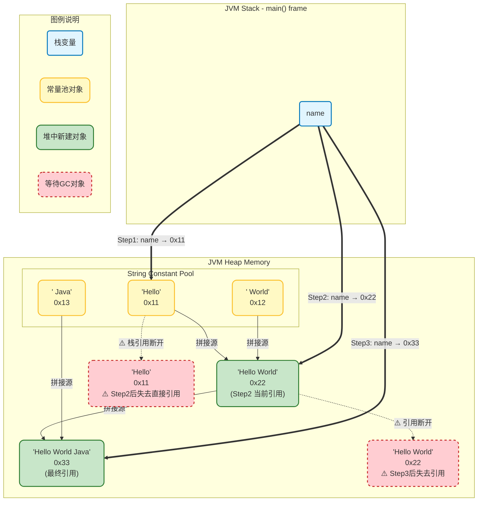

# 一、 API 概述与核心容器
## 一、API 概述

- **概念**：API 即应用程序接口（Application Programming Interface），是一些预先定义的函数、类、接口等的集合。它就像是不同软件组件之间沟通的桥梁，通过规定好的方式让开发者可以直接调用已有的功能，而无需了解其内部具体实现细节。
    
- **为什么要学 API**：
    
    1. **提高开发效率**：避免重复造轮子。使用现成的、成熟的 API 能快速实现复杂功能（如文件的读写、网络数据传输），大幅缩短开发周期。
        
    2. **保证代码质量**：官方或成熟的第三方 API 经过了极为苛刻的测试和底层性能优化，稳定性和安全性极高。
        
    3. **促进代码复用和协作**：统一的接口规范有利于团队分工协作与项目后期的高效维护。
        

## 二、String 类常用 API 详解

**为什么必须学习 String？**

1. **字符串是数据交互的核心载体**：几乎所有需要和用户交互的场景（如登录注册、商品展示、日志分析等）都离不开字符串属性。
    
2. **字符串是数据存储的基础格式**：无论是数据库中的文本字段（如 `VARCHAR`），还是配置文件（如 `.properties`、`.json`、`.xml`），其本质全都是字符串。
    
3. **字符串是算法与业务逻辑的基石**：敏感词过滤（`replace`）、银行卡号脱敏（`substring`）、日志时间戳切割（`split`）等日常业务核心功能全部基于字符串 API 展开。
    

### ① String 常用方法一览表

|方法签名|功能描述|
|---|---|
|**`int length()`**|返回字符串中的字符数量。|
|**`char charAt(int index)`**|获取指定索引位置处的单个字符。|
|**`char[] toCharArray()`**|将字符串转换为一个全新的字符数组。|
|**`boolean equals(Object anObject)`**|比较两个字符串内容是否完全相同（严格区分大小写）。|
|**`boolean equalsIgnoreCase(String anotherString)`**|比较两个字符串内容是否相同（忽略大小写差异）。|
|**`String substring(int beginIndex, int endIndex)`**|截取并返回从起始索引到结束索引（**包前不包后**）的子字符串。|
|**`String substring(int beginIndex)`**|从指定起始索引处直接截取并返回到原字符串末尾的子字符串。|
|**`String replace(CharSequence target, CharSequence replacement)`**|使用新内容替换字符串中的所有指定目标内容，并返回替换后的新对象。|
|**`boolean contains(CharSequence s)`**|判断字符串中是否包含了指定的子字符串。|
|**`boolean startsWith(String prefix)`**|判断字符串是否以指定的前缀子串开头。|
|**`boolean endsWith(String suffix)`**|判断字符串是否以指定的后缀子串结尾。|
|**`String[] split(String regex)`**|根据指定的分隔符正则表达式，将字符串分割并返回一个字符串数组。|
|**`String trim()`**|去除并返回字符串首尾两侧的所有空白字符。|

### ② 核心方法代码演示与控制台输出

#### 1. 获取字符串长度

`length()` 方法用于返回字符串的长度，即字符串中字符的个数。
```java title="StringLengthExample"
public class StringLengthExample {
    public static void main(String[] args) {
        String re = "JavaStandard";
        // 快速获取字符串长度
        System.out.println(re.length()); // 返回 12 表示有 12 个字符
    }
}
```

- **控制台运行输出结果**：
```bash
12
```
#### 2. 提取字符串中某个索引位置处的字符

`charAt(int index)` 方法可以获取字符串中指定索引位置的字符，索引从 0 开始。
```java title="StringCharAtExample"
public class StringCharAtExample {
    public static void main(String[] args) {
        String re = "JavaStandard";
        // 提取字符串中某个索引位置处的字符
        // 比如我想把 re 里的 "S" 提取，索引为 4
        char c = re.charAt(4);
        System.out.println(c);
    }
}
```

- **控制台运行输出结果**：
```bash
S
```

#### 3. 字符串的遍历

可以使用 `for` 循环结合 `charAt()` 方法遍历字符串中的每个字符。也可以先将字符串转换为字符数组，再进行遍历。
```java title="StringTraversalExample"
public class StringTraversalExample {
    public static void main(String[] args) {
        String re = "JavaStandard";
        // 字符串的遍历
        for (int i = 0; i < re.length(); i++) {
            // i = 0 1 2 ... 11
            char ch = re.charAt(i);
            System.out.println(ch);
        }
        System.out.println();

        // 把字符串转换成字符数组，再进行遍历
        char[] chars = re.toCharArray();
        for (int i = 0; i < chars.length; i++) {
            System.out.print(chars[i]);
        }
        System.out.println();
    }
}
```

- **控制台运行输出结果**：
```bash
J
a
v
a
S
t
a
n
d
a
r
d

JavaStandard
```

#### 4. 判断字符串与另一个字符串是否相等

`equals(Object anObject)` 方法用于比较两个字符串的内容是否相等，而 `==` 比较的是两个字符串对象的内存地址引用是否相同。
``` java title ="StringEqualsExample"
public class StringEqualsExample {
    public static void main(String[] args) {
        // 判断字符串与另一个字符串是否相等，相等则返回 true
        String s1 = new String("Hello");
        String s2 = new String("Hello");
        System.out.println(s1 == s2); // false (指向堆中不同的新对象)
        System.out.println(s1.equals(s2)); // true (内容完全相同)
    }
}
```

- **控制台运行输出结果**：
```bash
false
true
```

#### 5. 忽略大小写判断字符串内容是否一样

`equalsIgnoreCase(String anotherString)` 方法用于忽略大小写比较两个字符串的内容是否相等。
```java title="StringEqualsIgnoreCaseExample"
public class StringEqualsIgnoreCaseExample {
    public static void main(String[] args) {
        // 忽略大小写判断当前字符串与另一个字符串内容是否一样
        String c1 = new String("abc");
        String c2 = new String("Abc");
        System.out.println(c1.equals(c2)); // false (严格区分大小写)
        System.out.println(c1.equalsIgnoreCase(c2)); // true (忽略大小写)
    }
}
```

- **控制台运行输出结果**：
```bash
false
true
```

#### 6. 截取字符串

`substring(int beginIndex, int endIndex)` 方法用于从指定的起始索引截取到结束索引（包前不包后），`substring(int beginIndex)` 方法用于从指定索引截取到字符串末尾。
```java title="StringSubstringExample"
public class StringSubstringExample {
    public static void main(String[] args) {
        // 从传入的索引处截取字符串内容 (包前不包后)
        String s3 = "Java是世界上最好的编程语言之一";
        String rs1 = s3.substring(0, 8);  // 0 - 7 共8个字符，不包括 8
        String rs2 = s3.substring(8, 15); // 8 - 14 共7个字符，不包括 15
        System.out.println(rs1);
        System.out.println(rs2);

        // 从传入的索引直接截取到末尾字符串返回
        String rs3 = s3.substring(5);
        System.out.println(rs3);
    }
}
```

- **控制台运行输出结果**：
```bash
Java是世界上
最好的编程语言
界上最好的编程语言之一
```

#### 7. 替换字符串内容

`replace(CharSequence target, CharSequence replacement)` 方法用于将字符串中的指定内容替换为新的内容，并返回一个新的字符串对象。
```java title="StringReplaceExample"
public class StringReplaceExample {
    public static void main(String[] args) {
        // 把字符串的内容替换成新内容，并返回新的字符串对象给我们
        String info = "这个电影简直是个垃圾,垃圾电影!!";
        String rs4 = info.replace("垃圾", "**");
        System.out.println(info);
        System.out.println(rs4);
    }
}
```

- **控制台运行输出结果**：
```bash
这个电影简直是个垃圾,垃圾电影!!
这个电影简直是个**,**电影!!
```

#### 8. 判断字符串中是否包含某个字符串

`contains(CharSequence s)` 方法用于判断字符串中是否包含指定的子字符串。
```java title="StringContainsExample"
public class StringContainsExample {
    public static void main(String[] args) {
        // 判断字符串中是否包含了某个字符串
        String s3 = "Java是世界上最好的编程语言之一";
        boolean rs5 = s3.contains("Java");
        System.out.println(s3.contains("Java"));
        System.out.println(s3.contains("Java1"));
        System.out.println(rs5);
    }
}
```

- **控制台运行输出结果**：
```java
true
false
true
```

#### 9. 判断字符串是否以某个字符串开头

`startsWith(String prefix)` 方法用于判断字符串是否以指定的前缀开头，`startsWith(String prefix, int toffset)` 方法用于从指定索引位置开始判断是否以指定前缀开头。
```java title="StringStartsWithExample"
public class StringStartsWithExample {
    public static void main(String[] args) {
        // 判断字符串是否以某个字符串开头
        String rs6 = "Java,你好";
        System.out.println(rs6.startsWith("J"));
        System.out.println(rs6.startsWith("Java"));
        System.out.println(rs6.startsWith("你好"));
        System.out.println(rs6.startsWith("你好", 5)); // 从索引5处判断
    }
}
```

- **控制台运行输出结果**：
```bash
true
true
false
true
```

#### 10. 分割字符串

`split(String regex)` 方法用于根据指定的分隔符将字符串分割成字符串数组。
```java titlel="StringSplitExample"
public class StringSplitExample {
    public static void main(String[] args) {
        // 把字符串按照某个字符串内容分割，并返回字符串数组
        String str1 = "Tom,Jerry,Spike";
        String[] split = str1.split(",");
        for (int i = 0; i < split.length; i++) {
            System.out.println(split[i]);
        }
    }
}
```

- **控制台运行输出结果**：
```bash
Tom
Jerry
Spike
```

#### 11. 反转字符串

可以使用 `StringBuilder` 类的 `reverse()` 方法来反转字符串。
```java title="StringReverseExample"
public class StringReverseExample {
    public static void main(String[] args) {
        // 反转字符串并返回
        String number = "12345";
        // 根据参数字符串对象 s 创建一个新的 StringBuilder 对象 sb
        StringBuilder sb = new StringBuilder(number);
        // 把 StringBuilder 对象中的内容反转
        sb.reverse();
        // 把 StringBuilder 对象中的内容再转换成一个新的字符串
        String newStr = sb.toString();
        System.out.println(newStr);
    }
}
```

- **控制台运行输出结果**：
```bash
54321
```

### ④ String 的注意事项与内存机制

#### 1. String 类对象的不可变性

`String` 类是不可变字符。也就是说，**一个 String 对象一旦被创建，它在堆内存中的字符内容就绝对无法被修改！**

**示例代码:**
```java title="StringImmutabilityExample"
public class StringImmutabilityExample {
    public static void main(String[] args) {
        String name = "Hello";
        name = name + " World";
        name = name + " Java";
        System.out.println(name); // 输出: Hello World Java
    }
}
```

- **内存图解分析**：
    
    - 执行第一步时，堆中的**字符串常量池**中会生成一个 `"Hello"` 的字符串对象，其地址（如 `0x11`）赋给栈中的变量 `name`。
        
    - 当执行 `name = name + " World";` 时，系统先在常量池生成新对象 `" World"`，然后开辟全新的堆内存，将二者拼接，产生一个全新的字符串对象 `"Hello World"`（如 `0x22`），并将 `0x22` 地址重写赋给 `name`。**原先的 `0x11` 内容没有任何变化，只是失去了引用，等待被垃圾回收。**
        
    - 第二次拼接同理。因此，**对 String 的修改，本质上是让引用指向了全新的对象空间！**
        

#### 2. 字符串双引号字面量与 new 创建的区别

- **双引号直接写出的字面量**：数据存储在堆内存的**字符串常量池**中。相同内容的字面量在常量池中**有且仅有一份**，实现内存共享。
    
- **通过 `new` 构造器创建的对象**：每使用 `new` 关键字一次，都会在堆内存中重新开辟一片全新的独立对象空间。
```java tiele = "StringCreationDifference"
public class StringCreationDifference {
    public static void main(String[] args) {
        // 双引号字面量形式：共享常量池同一地址
        String str1 = "HelloWorld";
        String str2 = "HelloWorld";
        
        // new 关键字形式：在堆内存中重新开辟两份不同的空间
        String str3 = new String("HelloWorld");
        String str4 = new String("HelloWorld");

        System.out.println("str1 == str2: " + (str1 == str2)); // true (地址完全相同)
        System.out.println("str1 == str3: " + (str1 == str3)); // false (地址不同)
        System.out.println("str3 == str4: " + (str3 == str4)); // false (物理地址不同)
        System.out.println("内容比较结果：" + str1.equals(str3)); // true (内容完全相同)
    }
}
```

- **控制台运行输出结果**：
```bash
str1 == str2: true
str1 == str3: false
str3 == str4: false
内容比较结果: true
```