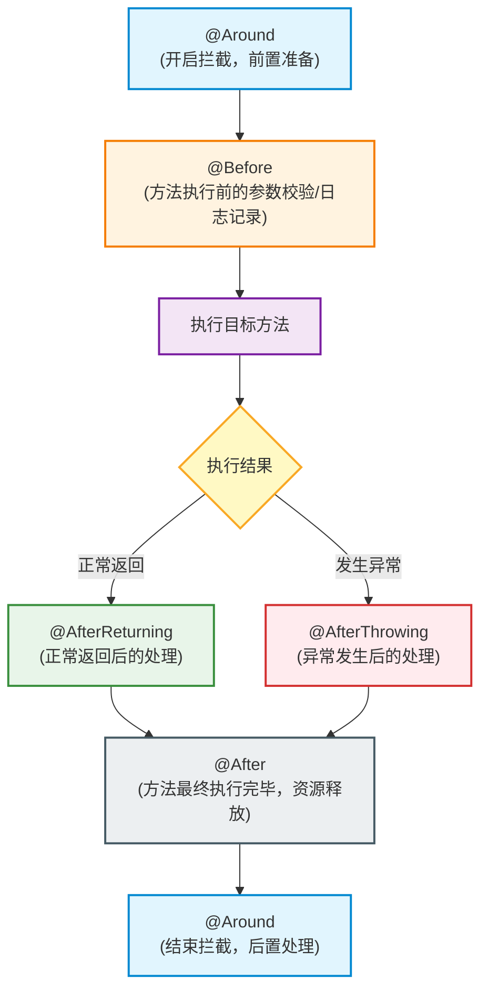

# Spring Boot 核心注解全景速查指南

本指南旨在为 Java 架构师与开发者提供一套结构严谨、内容完善的 Spring Boot 核心注解速查参考，便于日常开发查阅及技术规范落地。

## 目录

1. [核心与配置类注解](#一核心与配置类注解)
2. [Web 控制层注解](#二web-控制层注解)
3. [业务层与依赖注入注解（含构造器注解）](#三业务层与依赖注入注解含构造器注解)
4. [事务与切面（AOP）注解](#四事务与切面aop注解)
5. [测试层注解](#五测试层注解)
6. [条件装配注解](#六条件装配注解)
7. [Spring Boot 学习与应用路线图](#七spring-boot-学习与应用路线图)

## 一、核心与配置类注解

作为项目的基石，核心配置注解决定了 Spring 容器的初始化行为、自动装配规则以及外部属性的注入方式。

|                                |                                                                                                             |                                                        |
| ------------------------------ | ----------------------------------------------------------------------------------------------------------- | ------------------------------------------------------ |
| **注解**                       | **核心语义说明**                                                                                            | **典型应用位置**                                       |
| **`@SpringBootApplication`**   | 项目启动总开关，是一个三合一组合注解，包含 `@Configuration`、`@EnableAutoConfiguration` 和 `@ComponentScan` | 启动类（包含 `main` 方法的类）上方                     |
| **`@Configuration`**           | 声明该类为配置类，相当于传统 Spring 项目中的 XML 配置文件                                                   | 配置类类名上方                                         |
| **`@Bean`**                    | 将方法的返回值注入到 Spring 容器中，使其成为容器管理的一个组件                                              | `@Configuration` 配置类内部的方法上                    |
| **`@ComponentScan`**           | 指示 Spring 扫描特定包下的组件（带有 `@Component` 及其派生注解的类）。默认扫描启动类所在的包及子包          | 通常由 `@SpringBootApplication` 隐式包含，无需手动配置 |
| **`@EnableAutoConfiguration`** | 启动自动装配机制，Spring 会根据类路径（Classpath）中引入的依赖自动配置环境                                  | 通常由 `@SpringBootApplication` 隐式包含               |
| **`@Value`**                   | 从配置文件（如 `application.yml`）中读取单个配置项并注入变量                                                | 类的成员变量或方法参数上                               |
| **`@ConfigurationProperties`** | 批量读取配置文件中指定前缀的一组属性，并将其映射/绑定到一个 Java Bean 上                                    | 用于接收配置的 Java 类或 `@Bean` 方法上                |

### 核心机制深度解析

#### 1. `@SpringBootApplication` 的“三合一套餐”

在每个 Spring Boot 启动类上默认标注该注解。它内部集成了三个核心组件：

- **`@Configuration`**：定义配置类。
- **`@EnableAutoConfiguration`**：开启自动配置，根据 Maven/Gradle 引入的 Starter 依赖自动构建相关的 Bean。
- **`@ComponentScan`**：默认扫描当前包及其子包下的所有组件。

#### 2. 属性注入双雄：`@Value` vs `@ConfigurationProperties`

- **`@Value("${app.token.secret}")`**：适用于注入零散的、简单的单项配置，如密钥、外部 API 地址等。
- **`@ConfigurationProperties(prefix = "aliyun.oss")`**：适用于具有层级结构的一组配置（如 OSS 的 endpoint、bucket、key 等），能自动映射成一个类型安全的 Java 对象，支持嵌套、松散绑定（Relaxed Binding）和 JSR-303 校验。

#### 3. `@Bean` 的黄金应用场景

当需要将第三方开源库（如 Redis 客户端 `Redisson`、自定义线程池 `Executor` 等）的对象交由 Spring 容器管理时，由于无法修改第三方库的源码并在上面加 `@Component`，必须在配置类中编写方法创建该对象，并使用 `@Bean` 标注该方法。

## 二、Web 控制层注解

构建 RESTful API 时，控制层注解用于定义路由规范、解析请求参数以及输出标准 JSON 响应。

|                             |                                                                                |                     |
| --------------------------- | ------------------------------------------------------------------------------ | ------------------- |
| **注解**                    | **核心语义说明**                                                               | **典型应用位置**    |
| **`@RestController`**       | 声明该类是处理 HTTP 请求的控制器，且所有接口默认返回 JSON/XML 文本而非视图页面 | Controller 类名上方 |
| **`@RequestMapping`**       | 映射 HTTP 请求路径。用在类上代表基础路径，用在方法上代表具体接口路径           | 类名上方或方法上方  |
| **`@GetMapping`**           | `@RequestMapping(method = RequestMethod.GET)` 的快捷语义写法                   | Controller 方法上方 |
| **`@PostMapping`**          | `@RequestMapping(method = RequestMethod.POST)` 的快捷语义写法                  | Controller 方法上方 |
| **`@PathVariable`**         | 提取 URL 路径中的动态参数，如 `/users/{id}` 中的 `id`                          | 方法参数前面        |
| **`@RequestParam`**         | 提取 HTTP 查询参数（如 `?name=spring`）或表单参数                              | 方法参数前面        |
| **`@RequestBody`**          | 将 HTTP 请求体（Body）中的 JSON 字符串反序列化为 Java 对象                     | 方法参数前面        |
| **`@RequestHeader`**        | 获取 HTTP 请求头（Header）中的属性，例如 Authorization Token                   | 方法参数前面        |
| **`@CookieValue`**          | 获取客户端请求携带的特定 Cookie 值                                             | 方法参数前面        |
| **`@Validated` / `@Valid`** | 激活参数校验机制，配合 DTO 类中的 Bean Validation 注解（如 `@NotNull`）使用    | 方法参数前面        |

### 核心机制深度解析

#### 1. 控制器组合拳

`@RestController` 实际上是 `@Controller` + `@ResponseBody` 的组合体。在前后端分离的架构中，它确保了方法返回的 Java 对象能够被自动转换为 JSON 输出。

#### 2. 参数接收方式速查

```
GET /api/v1/users/1002?status=active
                  └───┬──┘     └────┬─┘
         @PathVariable("id")     @RequestParam("status")
         获取路径中的占位符        获取 URL 问号后的查询参数

POST /api/v1/users
Content-Type: application/json
Body: {"nickname": "Archie", "age": 28}  ──> @RequestBody UserDto userDto
                                             将 JSON 载荷解析为 Java DTO 对象
```

#### 3. 健壮的入参校验机制

在 DTO (Data Transfer Object) 类中，可以使用标准注解约束字段：

```
public class UserRegisterDto {
    @NotBlank(message = "用户名不能为空")
    private String username;

    @Min(value = 18, message = "未满18岁禁止注册")
    private Integer age;
}
```

在 Controller 接口中通过 `@Validated` 触发校验，任何不合规的参数都会直接抛出 `MethodArgumentNotValidException`，配合全局异常处理器可以实现优雅的统一报错响应。

## 三、业务层与依赖注入注解（含构造器注解）

此部分涵盖了 Spring 的三层架构（Service, Repository）分层标识以及核心的依赖注入规范，同时引入了 Lombok 辅助构造器注解。

### 1. 核心分层与注入注解

|                   |                                                                                               |                                             |
| ----------------- | --------------------------------------------------------------------------------------------- | ------------------------------------------- |
| **注解**          | **核心语义说明**                                                                              | **典型应用位置**                            |
| **`@Service`**    | 标识业务逻辑组件（Service 层）                                                                | Service 接口的实现类上方                    |
| **`@Repository`** | 标识数据访问组件（DAO/Repository 层），并能自动将数据库底层异常转化为 Spring 统一数据访问异常 | Mapper 类或 DAO 实现类上方                  |
| **`@Component`**  | 通用的组件声明。当一个类不属于 Controller、Service 或 Repository 时，使用此注解               | 工具类、过滤器、监听器等类名上方            |
| **`@Autowired`**  | 自动装配依赖的 Bean。默认按类型（by Type）装配，若有多个匹配则按名称（by Name）装配           | 构造器、字段、Setter 方法上方               |
| **`@Qualifier`**  | 明确指定要注入的 Bean 名称。常与 `@Autowired` 联合使用，解决同类型多实例的注入冲突            | 注入点（如字段或参数）前面                  |
| **`@Primary`**    | 当容器中存在多个同类型 Bean 时，将当前 Bean 设为默认首选 Bean                                 | 目标 Bean 的定义处（类上或 `@Bean` 方法上） |
| **`@Scope`**      | 声明 Bean 的生命周期范围，常用的有 `singleton`（单例，默认）和 `prototype`（多例）            | 类名或 `@Bean` 方法上方                     |
| **`@Lazy`**       | 延迟初始化 Bean。该 Bean 不会在容器启动时创建，而是在第一次被调用时才初始化                   | 类名、字段、方法或参数上方                  |

### 2. 构造器相关注解（Lombok 与依赖注入配合）

|                                |                                                                                     |                                            |
| ------------------------------ | ----------------------------------------------------------------------------------- | ------------------------------------------ |
| **注解**                       | **核心语义说明**                                                                    | **典型应用位置**                           |
| **`@NoArgsConstructor`**       | 自动生成无参构造方法。许多框架（如 JPA 实体、Jackson 反序列化）要求类必须有无参构造 | 实体类（Entity）、DTO 上方                 |
| **`@AllArgsConstructor`**      | 自动生成包含类中所有成员变量的构造方法                                              | 实体类（Entity）、DTO 上方                 |
| **`@RequiredArgsConstructor`** | 自动生成包含所有 `final` 字段或带有 `@NonNull` 约束字段的构造方法                   | Service、Controller 等需要注入依赖的类上方 |

### 依赖注入最佳实践：构造器注入代替字段注入

在早期的 Spring 项目中，使用字段注入（`@Autowired` 加在私有字段上）非常普遍，但在现代企业级开发中，**构造器注入**（Constructor Injection）是 Spring 官方强烈推荐的首选方式。

#### ❌ 不推荐：字段注入（Field Injection）

```
@Service
public class OrderService {
    @Autowired
    private PaymentClient paymentClient; // 缺点：不通过容器很难进行单元测试，且容易导致隐式的循环依赖
}
```

#### ✅ 强烈推荐：利用 `@RequiredArgsConstructor` 实现简洁的构造器注入

结合 Lombok，我们可以声明依赖字段为 `final`，然后使用 `@RequiredArgsConstructor` 自动生成对应的构造方法。Spring 会自动通过该构造方法完成依赖注入，代码极其干净。

```
@Service
@RequiredArgsConstructor // 自动生成包含 paymentClient 的构造方法
public class OrderService {
    // 声明为 final，确保依赖不可变
    private final PaymentClient paymentClient;

    // 生成的构造函数等同于：
    // public OrderService(PaymentClient paymentClient) {
    //     this.paymentClient = paymentClient;
    // }
}
```

**为什么推荐构造器注入？**

1. **不可变性**：注入的依赖可以声明为 `final`，防止在运行时被意外篡改。
2. **单一职责显式化**：当一个类的构造方法参数过多（例如超过 5 个），编译器或静态代码检查会很直观地提醒开发者该类可能承担了太多职责，需要进行重构。
3. **利于测试**：在编写单元测试时，不依赖 Spring 容器也能直接通过 `new OrderService(mockPaymentClient)` 实例化对象，测试更加轻量、快速。
4. **避免空指针异常 (NPE)**：确保类在初始化时，其必需的依赖已经完全准备就绪。

### 多 Bean 冲突处理方案

当一个接口存在多个实现类时，直接装配会引发 `NoUniqueBeanDefinitionException`。

- **方案 A（全局默认优先）**：在首选的实现类上标注 `@Primary`。
- **方案 B（按需指定装配）**：在注入位置使用 `@Qualifier("specificBeanName")` 指定具体装配哪一个 Bean。

## 四、事务与切面（AOP）注解

事务管理保障了数据的一致性，而面向切面编程（AOP）则用于剥离非业务核心的公共逻辑（如日志、安全、限流等）。

|                       |                                                                                |                        |
| --------------------- | ------------------------------------------------------------------------------ | ---------------------- |
| **注解**              | **核心语义说明**                                                               | **典型应用位置**       |
| **`@Transactional`**  | 声明式事务。保证方法内的一系列数据库操作要么全部成功，要么在抛出异常时完全回滚 | Service 方法或类名上方 |
| **`@Aspect`**         | 声明该类是一个切面类，包含切入点和通知定义                                     | 切面类名上方           |
| **`@Pointcut`**       | 定义切入点表达式（即切入哪些方法），明确“在何处”织入切面逻辑                   | 切面类内的方法上方     |
| **`@Before`**         | 前置通知，在目标方法执行之前运行                                               | 切面类的方法上方       |
| **`@After`**          | 后置通知，在目标方法执行完毕之后运行（无论成功与否）                           | 切面类的方法上方       |
| **`@AfterReturning`** | 返回通知，在目标方法正常执行完毕并返回结果后运行                               | 切面类的方法上方       |
| **`@AfterThrowing`**  | 异常通知，在目标方法抛出异常后运行                                             | 切面类的方法上方       |
| **`@Around`**         | 环绕通知，最强大的通知类型。可以完全控制目标方法的执行时机、修改入参或出参     | 切面类的方法上方       |

### 核心机制深度解析

#### 1. `@Transactional` 的核心失效场景及规避手段

事务未按预期回滚通常由以下三个因素导致：

1. **非 public 方法**：`@Transactional` 只能应用在 `public` 方法上。如果用在 `private`、`protected` 方法上，Spring AOP 代理无法拦截，事务将直接失效。
2. **同类内部自调用**：如果类内部的方法 `A()` 调用同一个类中的标注了 `@Transactional` 的方法 `B()`，由于没有经过 Spring 代理对象（绕过了 Proxy），事务不会生效。_解决方法：将 B 方法移到其他 Service 中，或者通过 AopContext 获取当前代理对象进行调用。_
3. **默认回滚策略局限**：Spring 默认只在遇到 `RuntimeException` 或 `Error` 时才触发回滚。若发生受检异常（Checked Exception，如 `IOException`、`SQLException`），则不会回滚。
   - **最佳实践**：始终显式指定回滚范围：`@Transactional(rollbackFor = Exception.class)`。

#### 2. AOP 通知模型（环绕流程图）



## 五、测试层注解

高效的测试策略能显著减少构建时间和系统资源消耗。Spring Boot 支持局部切片测试，避免每次测试都启动完整的应用上下文。

|                       |                                                                                         |                         |
| --------------------- | --------------------------------------------------------------------------------------- | ----------------------- |
| **注解**              | **核心语义说明**                                                                        | **典型应用位置**        |
| **`@SpringBootTest`** | 启动完整的 Spring 容器上下文进行集成测试。功能最全但启动速度最慢                        | 集成测试类名上方        |
| **`@WebMvcTest`**     | 窄范围切片测试。仅加载 Web 层（如 Controller、Filter），不加载 Service 和 DAO，运行极快 | Controller 测试类名上方 |
| **`@DataJpaTest`**    | 窄范围切片测试。仅加载数据库相关的 Repository 对应上下文，默认使用内存数据库            | Repository 测试类名上方 |
| **`@MockBean`**       | 创建一个 Mock 虚假对象并注入到 Spring 容器中，用以替换真实的组件，从而隔离外部依赖      | 测试类的成员变量上方    |

### 切片测试与隔离机制

- 在测试控制层逻辑时，并不需要真实查询数据库。可以使用 `@WebMvcTest(UserController.class)` 搭配 `@MockBean` 来模拟业务组件：

```java
@WebMvcTest(UserController.class)
public class UserControllerTest {

    @Autowired
    private MockMvc mockMvc;

    @MockBean
    private UserService userService; // 模拟 Service 层，避免真实调用

    @Test
    public void testGetUser() throws Exception {
        // 定义 Mock 的行为
        BDDMockito.given(userService.findById(1L))
                  .willReturn(new User(1L, "Archie"));

        mockMvc.perform(MockMvcRequestBuilders.get("/users/1"))
               .andExpect(MockMvcResultMatchers.status().isOk())
               .andExpect(MockMvcResultMatchers.jsonPath("$.name").value("Archie"));
    }
}
```

## 六、条件装配注解

条件装配是 Spring Boot 实现“约定大于配置”及自动化配置（Starter 机制）的核心技术。

|                                 |                                                                    |                                                              |
| ------------------------------- | ------------------------------------------------------------------ | ------------------------------------------------------------ |
| **注解**                        | **核心语义说明**                                                   | **典型应用场景**                                             |
| **`@ConditionalOnProperty`**    | 当配置文件中指定的配置项（Properties/Yml）满足特定值时，组件才生效 | 功能开关、外部集成服务的开启/关闭                            |
| **`@ConditionalOnClass`**       | 当类路径（Classpath）下存在指定的 `.class` 文件时，组件才生效      | 根据项目中引入的 Jar 包依赖自动决定是否配置某功能            |
| **`@ConditionalOnMissingBean`** | 当 Spring 容器中不存在指定类型的 Bean 时，该 Bean 才会被创建       | 提供默认配置，同时留出余地让用户可以用自定义的 Bean 进行覆盖 |

### 自动装配原理示意

当我们在项目中引入 `spring-boot-starter-web` 依赖时：

1. Spring Boot 检测到类路径下存在 Tomcat 核心类：触发 `@ConditionalOnClass(Servlet.class)`。
2. Spring 检查容器中是否已经有用户自定义的数据源或服务器：未发现，触发 `@ConditionalOnMissingBean`，从而自动装配默认的内嵌 Tomcat 容器。

## 七、Spring Boot 学习与应用路线图

此阶段性路线图可以帮助您有步骤、有目的地消化这些核心注解，并逐步深入 Spring 源码生态。

```mermaid
flowchart LR
    A["📅 第1周\n核心 + Web 注解"] --> B("✅ 能写 RESTful API")
    B --> C["📅 第2周\nService + DAO 注解"]
    C --> D("✅ 能写完整 CRUD + 事务")
    D --> E["📅 第3周\n测试注解"]
    E --> F("✅ 能写单元测试")
    F --> G["🚀 进阶\nAOP + 条件装配"]
    G --> H("✅ 能读框架源码 / 写 Starter")

    style A fill:#e8f5e9,stroke:#2e7d32,stroke-width:2px,color:#1b5e20
    style C fill:#e3f2fd,stroke:#1565c0,stroke-width:2px,color:#0d47a1
    style E fill:#fff8e1,stroke:#f9a825,stroke-width:2px,color:#f57f17
    style G fill:#fce4ec,stroke:#c62828,stroke-width:2px,color:#b71c1c

    style B fill:#c8e6c9,stroke:#388e3c,stroke-width:2px
    style D fill:#bbdefb,stroke:#1976d2,stroke-width:2px
    style F fill:#ffecb3,stroke:#ffa000,stroke-width:2px
    style H fill:#f8bbd0,stroke:#d32f2f,stroke-width:2px
```


